# 03 — State dependency graph

Goal: identify subgraphs of recoil state that are loosely coupled, so the migration in [`04-migration-slices.md`](./04-migration-slices.md) can be done in independent pieces.

The data behind these diagrams lives in [`data/state-graph.json`](./data/state-graph.json) (machine-readable, with edges typed by `get`/`set`/`effect`/`syncReplica`) and [`data/state-graph.dot`](./data/state-graph.dot) (Graphviz, renderable with `dot -Tsvg state-graph.dot -o state-graph.svg`).

---

## §3.1 Methodology

**Nodes**

- One node per atom / selector / atomFamily / selectorFamily defined in `src/`.
- Family members (`hazardSelectionState('fluvial')`, `selectionState('assets')`, etc.) collapse to one node per family unless their consumers differ in a way that affects slicing — those exceptions are called out per-cluster.
- A few non-Recoil "boundary" nodes are included in the diagrams when they form the only edge between two slices: `<RecoilRoot>` (App), `<RecoilLocalStorageSync>`, `<RecoilURLSyncJSON>`, `<MapViewRouteSync>`, `RasterColorMapSourceProvider`. They are drawn as rectangles instead of rounded boxes.

**Edges**

| Edge type          | Meaning                                                                                                                                                         |
| ------------------ | --------------------------------------------------------------------------------------------------------------------------------------------------------------- |
| `get`              | The selector reads the dependency in `get()`.                                                                                                                   |
| `set`              | The selector writes the dependency in `set()`.                                                                                                                  |
| `default`          | An atom's `default` is another atom/family member (e.g. `sidebarExpandedState.default = sidebarVisibilityToggleState`; `mapLatState.default = mapLatUrlState`). |
| `effect`           | A `StateEffectRoot{,Async}` (or `useRecoilTransaction_UNSTABLE`) writes the target when the source changes.                                                     |
| `syncReplica`      | A `useSyncState` / `useSyncValueToRecoil` / `useSyncStateThrottled` push from source to target.                                                                 |
| `urlSync`          | An atom is linked to a URL query parameter via `urlSyncEffect`.                                                                                                 |
| `localStorageSync` | An atom is persisted via `syncEffect({ storeKey: 'local-storage' })`.                                                                                           |

**Slice boundaries** are identified by:

1. Files clustered by directory and feature (e.g. `state/data-layers/networks.ts` belongs to "Networks / damages").
2. Cut points where removing one node would disconnect two areas of the graph. These are the **hubs** in §3.4.

---

## §3.2 Top-level graph

High-level decomposition. Each slice box collapses many nodes — see §3.3 for the expanded per-cluster diagrams.

```mermaid
flowchart LR
    subgraph App["App shell"]
        recoilRoot[/RecoilRoot/]
        localStorageSync[/RecoilLocalStorageSync<br/>storeKey=local-storage/]
        urlSync[/RecoilURLSyncJSON<br/>storeKey=url-json/]
        routeSync[/MapViewRouteSync<br/>storeKey=map-view-route/]
        rasterProvider[/RasterColorMapSourceProvider/]
    end

    subgraph SidebarHub["Sidebar visibility hub"]
        sidebarVisibilityToggleState
        sidebarExpandedState
        sidebarPathChildrenState
        sidebarPathChildrenLoadingState
        sidebarPathVisibilityState
        sidebarSectionsUrlParamsState
    end

    subgraph DataParams["Data-params spine"]
        paramsConfigState
        paramsState
        paramValueState
        paramOptionsState
        dataParamsByGroupState
    end

    subgraph DataDomains["Data-domain queries (async)"]
        rasterAllSourcesQuery
        rasterSourceByDomainQuery
        rasterSourceDomainsQuery
        hazardDomainsConfigState
    end

    subgraph MapView["Map view + URL"]
        mapZoomUrlState
        mapLonUrlState
        mapLatUrlState
        nonCoordsMapViewStateState
        mapViewStateState
        mapFitBoundsState
    end

    subgraph MapBasemap["Map basemap + interaction mode"]
        backgroundState
        showLabelsState
        mapInteractionModeState
        pixelDrillerClickLocationState
        pixelDrillerSiteUrlState
    end

    subgraph Interactions["Map interactions"]
        hoverState
        hoverPositionState
        selectionState
        allowedGroupLayersState
        interactionGroupsState
    end

    subgraph Hazards["Hazards selection"]
        hazardSelectionState
        hazardVisibilityState
    end

    subgraph Networks["Networks / damages styling"]
        damageSourceState
        damageTypeState
        showInfrastructureRiskState
        damagesFieldState
        damageMapStyleParamsState
        networksStyleState
        networkTreeCheckboxState
        networkSelectionState
    end

    subgraph Exposure["Population & regional exposure"]
        populationExposureHazardState
        regionalExposureVariableState
    end

    subgraph NBS["NbS adaptation"]
        nbsAdaptationTypeState
        nbsRegionScopeLevelState
        nbsAdaptationHazardState
        nbsVariableState
        nbsSelectedScopeRegionState
        nbsStyleParamsState
        showPrioritisationState
    end

    subgraph DataLayers["Data-layer selectors (~22)"]
        viewLayersState
        viewLayersParamsState
        featureBoundingBoxLayerState
        boundedFeatureState
    end

    subgraph DamagesDetail["Damages drill-down (details panel)"]
        featureState
        hazardDataParamsState
        damagesDataState
        selectedRpDataState
        selectedHazardState
        selectedEpochState
        selectedRpOptionState
    end

    subgraph PixelDriller["Pixel driller accordion"]
        hazardAccordionExpandedState
        openAccordionState
        accordionTransitionCountState
    end

    subgraph Downloads["Downloads / jobs"]
        submittedJobsState
        completedJobsState
        lastSubmittedJobByParamsState
        expandedDatasetByRegionState
    end

    subgraph PlaceSearch["Place search"]
        placeSearchActiveState
        placeSearchQueryState
    end

    subgraph MobileTabs["Mobile tab content"]
        mobileTabHasContentState
    end

    subgraph RouteView["Route view (top tab)"]
        viewState
    end

    subgraph ColorMap["Raster colormap (async)"]
        colorMapValuesQuery
        terracottaColorMapValuesQuery
        apiFeatureQuery
    end

    subgraph ArticlesMap["Articles map (nested RecoilRoot)"]
        articleRoot[/nested RecoilRoot/]
    end

    localStorageSync -. localStorageSync .-> Downloads
    urlSync -. urlSync .-> SidebarHub
    urlSync -. urlSync .-> MapView
    urlSync -. urlSync .-> MapBasemap
    routeSync -. urlSync .-> RouteView
    RouteView -- effect --> SidebarHub
    SidebarHub --> DataLayers
    SidebarHub --> Networks
    SidebarHub --> Exposure
    SidebarHub --> NBS
    Hazards --> DataLayers
    Hazards --> SidebarHub
    DataParams --> DataLayers
    DataParams --> Networks
    DataParams --> Exposure
    DataParams --> Hazards
    DataDomains --> DataParams
    DataLayers --> Interactions
    Interactions --> NBS
    Interactions --> DamagesDetail
    Interactions --> DataLayers
    MapBasemap --> NBS
    MapView --> MapBasemap
    rasterProvider --> ColorMap
```

Legend for arrow styles:

- Solid arrow = `get`/`set` dependency (one slice's state reads/writes another's).
- Dotted arrow = external sync boundary (storage / URL / route param).

---

## §3.3 Per-cluster diagrams

For readability, family parameters are shown only when they vary in a slice. `key: value` pairs in the JSON describe each node fully.

### 3.3.1 Sidebar visibility hub

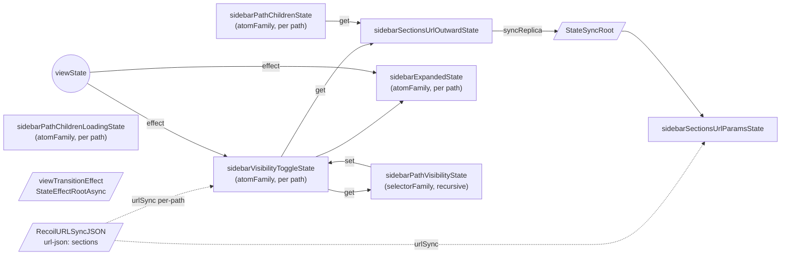

- `sidebarVisibilityToggleState` is the single source of truth for per-path leaf visibility, with two URL-sync paths converging on it: the explicit `urlSyncEffect` on `sidebarSectionsUrlParamsState`, and the per-path `defaultSectionVisibilitySyncEffect` set as an atom-family effect.
- `sidebarPathVisibilityState` (built by `makeHierarchicalVisibilityState`) is a recursive selectorFamily — both `get` and `set` walk up the path hierarchy. This single selector family is consumed by every `state/layers/data-layers/*.ts` file.

### 3.3.2 Data-params spine

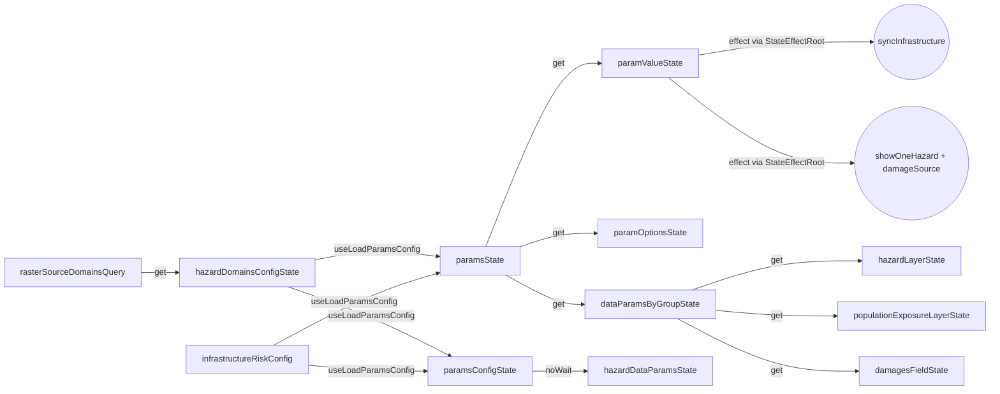

- `paramsConfigState` / `paramsState` are `atomFamily<...,string>` with `default: () => new Promise(() => {})` — they Suspend until `useLoadParamsConfig` fires (`useRecoilValueLoadable` is used to detect the unloaded state).
- Two configs feed in: `hazardDomainsConfigState` (async, from the API) and the local `infrastructureRiskConfig` atom (constant).
- `paramsState` is the _only_ atom in the spine that ever moves; `paramValueState`/`paramOptionsState`/`dataParamsByGroupState` are pure derivations.

### 3.3.3 Data-domain queries (API-backed)

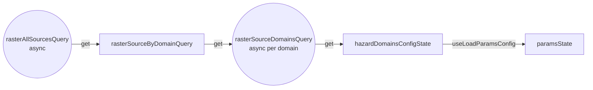

Three async selectors that hit `apiClient.tiles.*`. `rasterSourceDomainsQuery` is the deepest async-of-async; behave carefully when porting (`get` inside an async selectorFamily).

### 3.3.4 Map view + URL

```mermaid
flowchart LR
    urlJson[/RecoilURLSyncJSON<br/>url-json: x,y,z/]
    mapLatUrlState
    mapLonUrlState
    mapZoomUrlState
    mapLatState["mapLatState<br/>(default = mapLatUrlState)"]
    mapLonState["mapLonState<br/>(default = mapLonUrlState)"]
    mapZoomState["mapZoomState<br/>(default = mapZoomUrlState)"]
    nonCoordsMapViewStateState
    mapViewStateState["mapViewStateState<br/>(selector RW)"]
    mapFitBoundsState

    urlJson -. urlSync .-> mapLatUrlState
    urlJson -. urlSync .-> mapLonUrlState
    urlJson -. urlSync .-> mapZoomUrlState

    mapLatUrlState -- default --> mapLatState
    mapLonUrlState -- default --> mapLonState
    mapZoomUrlState -- default --> mapZoomState

    mapLatState -- get --> mapViewStateState
    mapLonState -- get --> mapViewStateState
    mapZoomState -- get --> mapViewStateState
    nonCoordsMapViewStateState -- get --> mapViewStateState

    mapViewStateState -- set --> mapLatState
    mapViewStateState -- set --> mapLonState
    mapViewStateState -- set --> mapZoomState
    mapViewStateState -- set --> nonCoordsMapViewStateState

    mapLatState -- syncReplica throttled .-> mapLatUrlState
    mapLonState -- syncReplica throttled .-> mapLonUrlState
    mapZoomState -- syncReplica throttled .-> mapZoomUrlState

    mapFitBoundsState -. consumer .-> MapView((MapView<br/>+ NbsPrioritisationPanel<br/>+ MapSearch))
```

- The URL atoms and the internal coord atoms are _separate_; data flows in both directions via the throttled `useSyncMapUrl` and the `default` reference. Be careful when porting: the internal atoms must keep deck.gl's view object identity stable (`dangerouslyAllowMutability: true` today).

### 3.3.5 Map basemap + pixel driller bridge

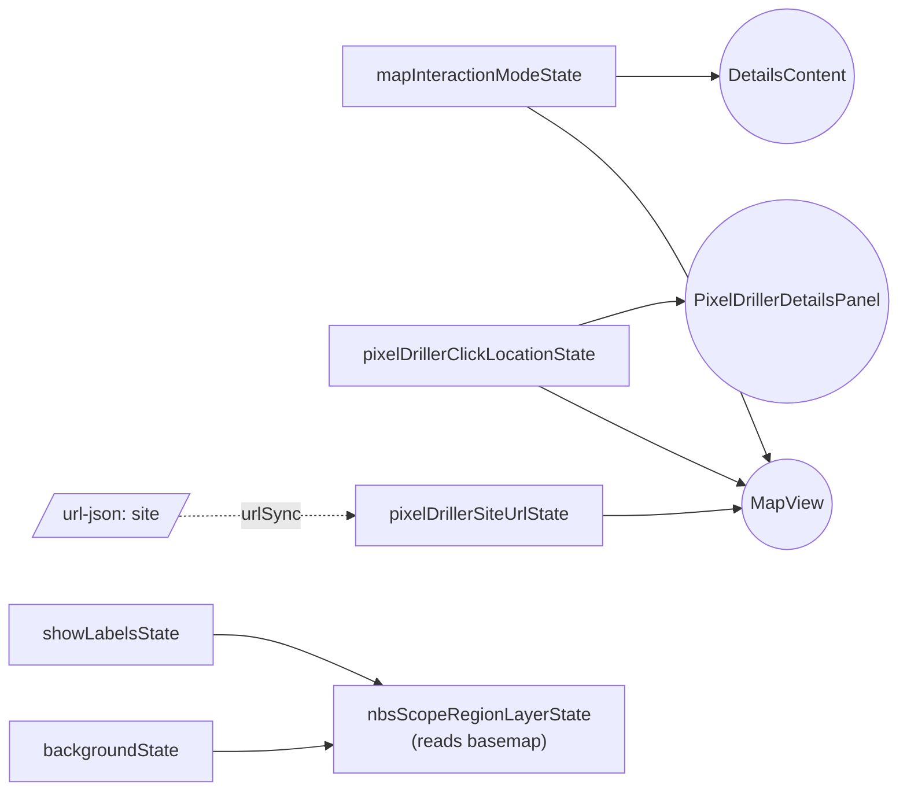

This slice has two distinct concerns lumped together because they only meet inside [`src/map/MapView.tsx`](../../../src/map/MapView.tsx) and not via the atom graph: (a) basemap (`backgroundState`, `showLabelsState`) bridges to NbS via `nbsScopeRegionLayerState`; (b) pixel driller URL ↔ click location ↔ interaction mode are wired by `useEffect`s inside `MapView.tsx`.

### 3.3.6 Map interactions

```mermaid
flowchart LR
    hoverState["hoverState<br/>(atomFamily per group)"]
    selectionState["selectionState<br/>(atomFamily per group)"]
    hoverPositionState
    allowedGroupLayersInternal
    allowedGroupLayersState["allowedGroupLayersState<br/>(selector RW)"]

    allowedGroupLayersInternal -- get --> allowedGroupLayersState
    allowedGroupLayersState -- set --> allowedGroupLayersInternal
    allowedGroupLayersState -- reset/set --> hoverState
    allowedGroupLayersState -- reset/set --> selectionState

    useInteractions((useInteractions)) -- syncReplica .-> allowedGroupLayersState
    useInteractions -- setter family --> hoverState
    useInteractions -- setter family --> selectionState
    useInteractions -- useSetRecoilState --> hoverPositionState

    selectionState --> DetailsContent((DetailsContent))
    selectionState --> NbsAdaptationSection((NbsAdaptationSection))
    selectionState --> nbsSelectedScopeRegionState((nbsSelectedScopeRegionState))
    hoverState --> Tooltip((InteractionGroupTooltip))
    hoverPositionState --> Tooltip
```

`allowedGroupLayersState` is a writable selector whose setter intelligently cascades resets / filtering into `hoverState(group)` and `selectionState(group)` — the only non-trivial writable selector in this slice. Use of `isReset` (from [`src/lib/recoil/is-reset.ts`](../../../src/lib/recoil/is-reset.ts)) lives here.

### 3.3.7 Hazards selection

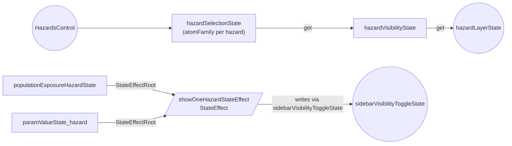

`showOneHazardStateEffect` is a `CurrentStateEffect` (from `lib/recoil/state-effects/types.ts`) that recursively turns on the visibility-toggle family along a path and turns siblings off — this is the single mechanism by which the hazards-selection slice writes into the sidebar visibility hub.

### 3.3.8 Networks / damages styling

```mermaid
flowchart LR
    showInfrastructureRiskState
    showInfrastructureDamagesState
    damageSourceState
    damageTypeState
    damagesFieldState
    damageMapStyleParamsState
    networksStyleState
    networkTreeCheckboxState
    networkSelectionState
    syncInfrastructureSelectionStateEffect[/syncInfrastructureSelectionStateEffect/]

    showInfrastructureRiskState -- get --> showInfrastructureDamagesState
    showInfrastructureDamagesState -- get --> networksStyleState
    damageSourceState -- get --> damagesFieldState
    damageTypeState -- get --> damagesFieldState
    dataParamsByGroupState((dataParamsByGroupState)) -- get --> damagesFieldState
    damagesFieldState -- get --> damageMapStyleParamsState
    damageMapStyleParamsState -- (via networksStyleState) --> networkStyleParamsState((networkStyleParamsState))
    networksStyleState -- get --> networkStyleParamsState
    networkTreeCheckboxState -- get --> networkSelectionState
    networkSelectionState -- get --> networkLayersState((networkLayersState))
    sidebarPathVisibility_exposure_infra((sidebarPathVisibilityState exposure/infrastructure)) -- get --> networkLayersState
    paramValueState_infrastructure_risk_sector -- StateEffectRoot --> syncInfrastructureSelectionStateEffect
    syncInfrastructureSelectionStateEffect -- writes --> networkTreeCheckboxState
    showInfrastructureRiskState -- LinkViewLayerToPath syncReplica .-> sidebarVisibilityToggleState_risk_infrastructure
    paramValueState_infrastructure_risk_hazard -- StateEffectRoot --> damageSourceState
```

Two-way coupling at three points:

1. The `LinkViewLayerToPath` pattern push-syncs `showInfrastructureRiskState` ↔ `sidebarVisibilityToggleState('risk/infrastructure')`.
2. The Infra Risk section's sector dropdown reads `paramValueState({ group: 'infrastructure-risk', param: 'sector' })` and `syncInfrastructureSelectionStateEffect` writes the result into the `networkTreeCheckboxState`.
3. Same section's hazard dropdown drives both `showOneHazardStateEffect` (writing the visibility hub) **and** `damageSourceState` (driving the damage styling chain).

### 3.3.9 Population & regional exposure

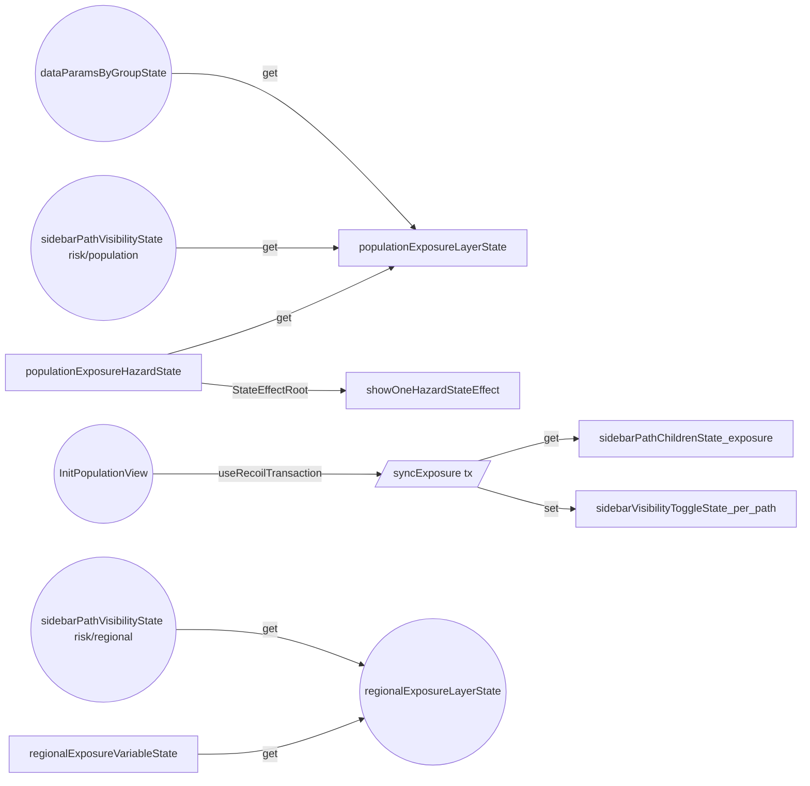

`syncExposure` / `hideExposure` are unstable transactions that explicitly write the leaf atomFamily (`sidebarVisibilityToggleState`) rather than the recursive selector family, because Recoil disallows setting selectors inside `transact_UNSTABLE`. In Jotai there is no such restriction, but keeping the same behavior is safer.

### 3.3.10 NbS adaptation

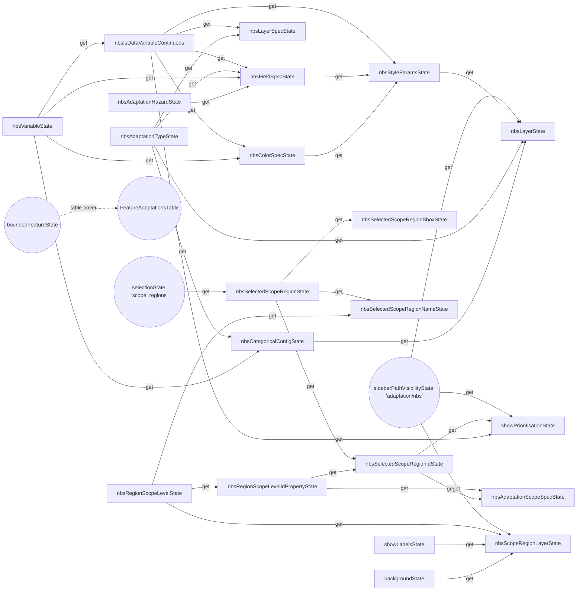

Largest single-file selector graph in the project. Bridges out via three nodes: `selectionState('scope_regions')`, `backgroundState`/`showLabelsState`, and `sidebarPathVisibilityState`.

### 3.3.11 Damages drill-down (details panel)

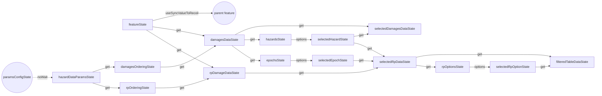

Internally complex but only two outward edges: `paramsConfigState` (read via `noWait`) and `apiFeatureQuery` (read in `asset-details.tsx` and passed into `featureState` via `useSyncValueToRecoil`).

### 3.3.12 Pixel driller accordion

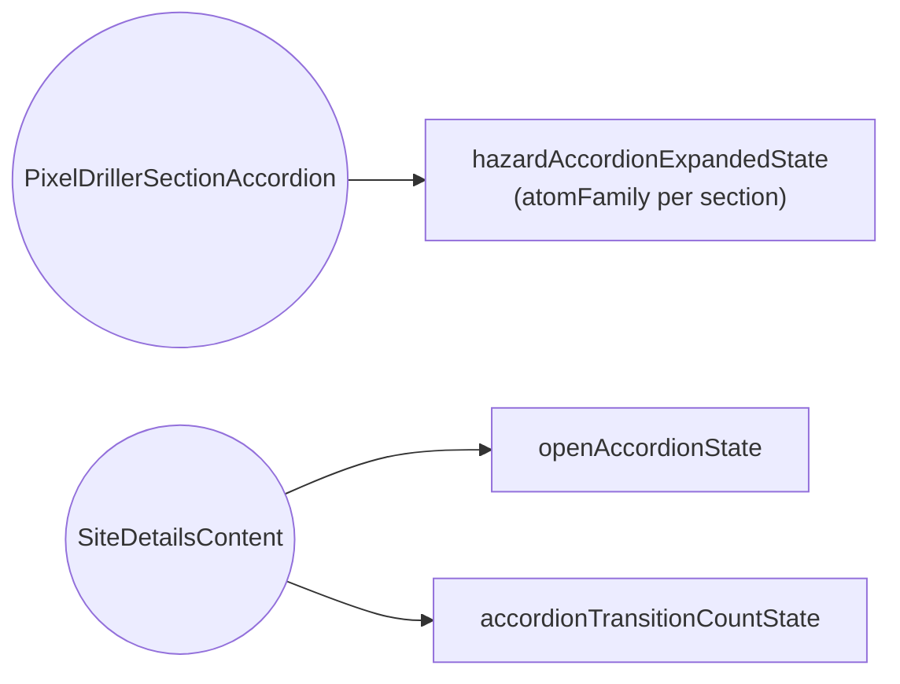

Self-contained.

### 3.3.13 Downloads / jobs

> **Decommissioned 2026-06-02.** Job-tracking Recoil (`jobs.ts`, localStorage sync) removed. Accordion state lives in inline Jotai in `ProcessorVersionListItem.tsx`; status chips use `usePackageData` only. Diagram below is the **April 2026 snapshot**.

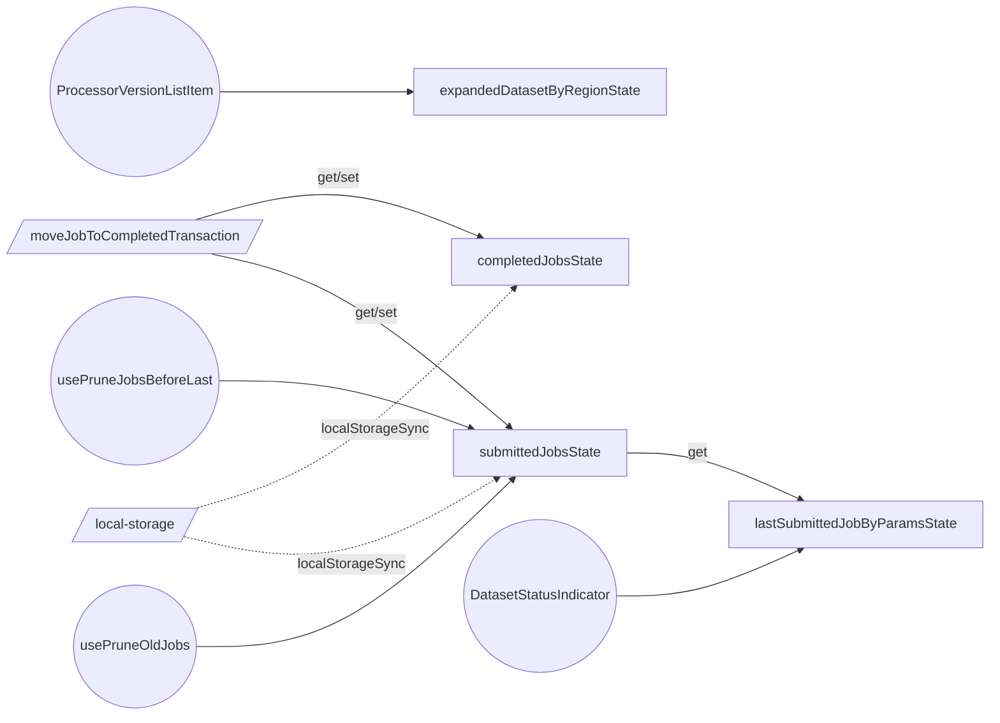

Two writable atoms persisted in localStorage; one selectorFamily; one transaction; one self-contained UI-state atomFamily. No outward edges into the rest of the graph.

### 3.3.14 Articles map

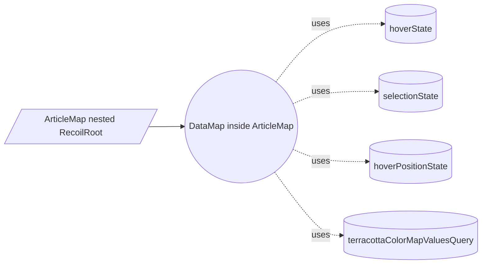

The nested `RecoilRoot` means **the article-map subtree owns its own copy of the entire atom graph** (all `*State` atoms re-instantiated). In practice, only `hoverState`, `selectionState`, `hoverPositionState`, and `terracottaColorMapValuesQuery` are exercised because the article map uses pre-baked `viewLayers` props rather than the app's data-layer selectors. **No data flows between the nested store and the main app store.**

---

## §3.4 Bridge & hub list

Nodes that, if removed, would split the graph into disconnected pieces. These are the migration cost centres.

| Node                                                              | Why it's a hub                                                                                                                                              |
| ----------------------------------------------------------------- | ----------------------------------------------------------------------------------------------------------------------------------------------------------- |
| `sidebarPathVisibilityState` (selectorFamily)                     | Read by every `state/layers/data-layers/*.ts` selector to gate its layer; also read by Infra Risk, Population Exposure, NbS prioritisation.                 |
| `sidebarVisibilityToggleState` (atomFamily)                       | Underlies `sidebarPathVisibilityState`; written by `showOneHazardStateEffect`, `syncExposure`, `viewTransitionEffect`, `LinkViewLayerToPath`, and URL sync. |
| `paramsState` / `paramsConfigState` (atomFamily)                  | Shared spine for hazard configs, infra-risk fake config, damage styling, exposure layers. Carries the intentional Suspense-on-mount default.                |
| `dataParamsByGroupState` (selectorFamily)                         | Read by `hazardLayerState`, `populationExposureLayerState`, `damagesFieldState`.                                                                            |
| `viewLayersState` (selector)                                      | Single `waitForAll` aggregator over ~22 sibling layer selectors. Eliminating it requires either a fan-in atom or migrating layer selectors in lockstep.     |
| `viewLayersParamsState` (selector + 2 internal selector families) | Pulls `selectionState(group)` per layer into deck.gl param objects — bridges interactions into rendering.                                                   |
| `selectionState` (atomFamily per group)                           | Bridges map picking ↔ details panel ↔ NbS scope region.                                                                                                     |
| `hoverState` / `hoverPositionState`                               | Bridges map picking ↔ tooltip rendering.                                                                                                                    |
| `allowedGroupLayersState` (selector RW)                           | The only writable selector with `isReset` semantics; central control for which layer ids can be picked.                                                     |
| `showOneHazardStateEffect`                                        | The only mechanism the hazards slice uses to mutate the sidebar visibility hub.                                                                             |
| `viewState`                                                       | Drives `viewTransitionEffect` writes into `sidebarExpandedState` + `sidebarVisibilityToggleState`.                                                          |
| `terracottaColorMapValuesQuery`                                   | Injected as the value of `RasterColorMapSourceProvider` — the _only_ way raster layers obtain colormaps.                                                    |

External hubs (non-atom):

| Boundary                 | Role                                               |
| ------------------------ | -------------------------------------------------- |
| `RecoilRoot` (`App.tsx`) | Owner of all non-article atoms.                    |
| `RecoilLocalStorageSync` | Storage gateway for the `local-storage` store key. |
| `RecoilURLSyncJSON`      | Storage gateway for the `url-json` store key.      |
| `MapViewRouteSync`       | Route-to-atom bridge for `viewState`.              |

---

## §3.5 Where the full graph lives

- [`data/state-graph.json`](./data/state-graph.json) — every atom/selector node, every edge (typed `get`/`set`/`default`/`effect`/`syncReplica`/`urlSync`/`localStorageSync`), and a `componentConsumers` map for each node listing the files and hooks that subscribe to it.
- [`data/state-graph.dot`](./data/state-graph.dot) — Graphviz source, with one cluster subgraph per slice. Render with:

```bash
dot -Tsvg .local/_AI_WORKSPACE/cursor/data/state-graph.dot -o /tmp/state-graph.svg
```

Both files are intended to be kept in sync with the rest of this analysis. See [`README.md`](./README.md) for the "how to refresh" notes.
