# 04 — Migration slices and playbook

Identifies independently-portable subgraphs of the Recoil state, sequences them, and gives a per-slice playbook for the actual code changes.

Companions: [`01-recoil-inventory.md`](./01-recoil-inventory.md) (call-site lists), [`02-jotai-mapping.md`](./02-jotai-mapping.md) (per-API mapping), [`03-state-graph.md`](./03-state-graph.md) (graph + hub list).

---

## §4.1 Recommended migration order

The high-level shape is "leaves first, hubs last", with two upfront infrastructure steps.

```mermaid
flowchart TD
    Step1[1. Add Jotai dependency<br/>Keep RecoilRoot mounted in parallel]
    Step2[2. Port lib/recoil/ helpers to lib/jotai/<br/>under new names, no callers yet]
    Step3[3. Build replacement sync layer<br/>localStorage + URL + route]
    Step4a[4a. Migrate Place search slice<br/>real pilot: truly leaf, no bridges]
    Step4b[4b. Migrate Mobile tabs and Pixel driller leaves]
    Step5[5. Migrate Downloads slice<br/>first real test of localStorage sync]
    Step6[6. Migrate Map basemap + interaction mode slice]
    Step7[7. Migrate Map view + URL coords slice<br/>first real test of URL sync]
    Step8[8. Migrate Damages drill-down details]
    Step9[9. Migrate Map interactions slice<br/>and view-layer params plumbing]
    Step9b[9b. Flip ArticleMap's RecoilRoot to Jotai Provider<br/>one-line follow-up to Step 9]
    Step10[10. Migrate NbS adaptation slice]
    Step11[11. Migrate Networks / damages styling slice]
    Step12[12. Migrate Population & regional exposure slice]
    Step13[13. Migrate Hazards selection slice]
    Step14[14. Migrate Data-params spine + data-domain queries]
    Step15[15. Migrate Sidebar visibility hub<br/>and view-layers aggregator]
    Step16[16. Remove RecoilRoot, recoil/recoil-sync packages]

    Step1 --> Step2 --> Step3 --> Step4a --> Step4b --> Step5 --> Step6 --> Step7 --> Step8 --> Step9 --> Step9b --> Step10 --> Step11 --> Step12 --> Step13 --> Step14 --> Step15 --> Step16
```



### Why this order

- **Infrastructure first (Steps 1-3).** Migrating any feature slice in isolation is painful as long as the sync helpers (`RecoilLocalStorageSync`, `RecoilURLSyncJSON`, `MapViewRouteSync`) still own the URL/storage protocol. Building Jotai-flavoured equivalents first means each feature slice has a deterministic landing pad.
- **Pilot is Place search, NOT Articles map.** Earlier versions of this plan listed Articles map as Step 4 because of its nested `RecoilRoot`. That was wrong: `<RecoilRoot>` only isolates atom _values_ at runtime, not atom _definitions_ (atoms are module-level singletons). ArticleMap uses `hoverState` / `selectionState` from `lib/data-map/interactions/interaction-state.ts`, which is consumed by 8 other files in the main app — so migrating ArticleMap atomically means migrating all of them at once. See §4.3 for the full reasoning. **Place search** has no such cross-cutting dependency and is the right pilot.
- **No separate "coexistence smoke test" step.** An earlier revision of this plan included one (mounting a Jotai `<Provider>` inside `ArticleMap` with no atoms attached). It was dropped: stacking two empty providers proves nothing the place-search migration doesn't already prove implicitly. The moment a real Jotai atom is consumed in the same app while Recoil is still mounted, coexistence is exercised end-to-end. ArticleMap also stays untouched until 9b per the original promise.
- **Downloads (Step 5) proves localStorage sync** end-to-end before any bigger feature depends on it.
- **Map view + URL coords (Step 7) proves URL sync** before any larger feature depends on it.
- **Step 9b is just a one-line flip.** Once Slice 9 has migrated `interaction-state.ts` to Jotai, ArticleMap's `<RecoilRoot>` becomes useless (its atoms are no longer Recoil) and can be swapped for `<Provider store={...}>` in one edit.
- **Hub slices come last (Steps 14-15)** because every other slice has at least one inbound edge to the hubs (`paramsState`, `sidebarPathVisibilityState`, `viewLayersState`). Migrating a hub before its consumers means writing a temporary two-way bridge for each consumer.
- **Removing `RecoilRoot` is the final step.** Until then, both libraries coexist — see "Coexistence pattern" below.

### Coexistence pattern (steps 1-15)

While both libraries are mounted:

```tsx
// src/App.tsx during migration
<RecoilRoot>
  <RecoilLocalStorageSync storeKey="local-storage">
    <RecoilURLSyncJSON storeKey="url-json" location={{ part: 'queryParams' }}>
      {/* Jotai needs no Provider in the default-store case;
          we just need to keep the helpers ported in step 3 available */}
      <JotaiStorageBootstrap />
      {/* ...rest of providers */}
    </RecoilURLSyncJSON>
  </RecoilLocalStorageSync>
</RecoilRoot>
```

Per-slice migrations don't add or remove providers — they replace `atom`/`selector` definitions and their consumer hooks file by file. A given component can mix `useRecoilValue(legacyAtom)` and `useAtomValue(newAtom)` during a transition (e.g. for the Damages drill-down, `featureState` could go first and `selectedHazardState` second). Just don't bridge a Recoil atom and a Jotai atom unless absolutely necessary — if you do, encapsulate it in a single short-lived helper:

```tsx
function RecoilToJotaiBridge<T>({
  from,
  to,
}: {
  from: RecoilValueReadOnly<T>;
  to: PrimitiveAtom<T>;
}) {
  const value = useRecoilValue(from);
  const setValue = useSetAtom(to);
  useEffect(() => {
    setValue(value);
  }, [value, setValue]);
  return null;
}
```

Delete every bridge during step 16.

---

## §4.2 Independent migration slices

For each slice: nodes inside (atoms/selectors), bridge nodes it touches, the files that change, an estimated risk level, and a per-slice playbook.

> **Note on previous plan revisions**:
>
> - An earlier version of this document listed "Articles map" as Slice 1. That was wrong — atom definitions are module-level singletons, so `ArticleMap`'s nested `<RecoilRoot>` doesn't isolate the migration boundary. See §4.3 for the full reasoning. ArticleMap is now Slice 9b — a one-line provider flip after Slice 9.
> - A subsequent revision then inserted "Slice 1 — Coexistence smoke test" that mounted an empty Jotai `<Provider>` inside `ArticleMap`. It was also dropped: it would have touched `ArticleMap` ahead of 9b for no real verification gain. The first slice that actually moves atoms (Place search, below) implicitly exercises coexistence anyway. Slice numbering below is preserved from the previous revision so cross-references in other docs stay valid — Slice 1 is intentionally empty.

### Slice 1 — _(intentionally empty)_

Reserved-but-skipped. No code change. See note above.

### Slice 2 — Place search (real pilot — first slice that actually moves atoms)

**Nodes**: `placeSearchActiveState`, `placeSearchQueryState`.

**Bridge nodes touched**: indirectly `mapFitBoundsState` (set by `MapSearchField` to fly to a location), but the place-search atoms themselves are leaves.

**Files**: [`src/lib/map/place-search/search-state.ts`](../../../src/lib/map/place-search/search-state.ts), [`src/lib/map/place-search/MapSearch.tsx`](../../../src/lib/map/place-search/MapSearch.tsx), [`src/lib/map/place-search/MapSearchField.tsx`](../../../src/lib/map/place-search/MapSearchField.tsx).

**Risk**: low.

**Playbook**

1. Replace the two `atom({ key, default })` with plain `atom(...)` from Jotai.
2. **Rename the exports** from `*State` → `*Atom` (`placeSearchActiveAtom`, `placeSearchQueryAtom`). This makes "what's been migrated" greppable and matches the Jotai convention used elsewhere in the plan (e.g. slice 5's `submittedJobsAtom`). Adopt the same rename for every future slice unless otherwise noted.
3. Replace `useRecoilState` calls with `useAtom`.
4. No sync, no families, no helpers needed.

**Status**: done (2026-05-19).

**Test plan**: open `/view/hazard`, click the search icon (chip should expand), type a place name into the search box (autocomplete should populate; the field's text should persist across re-expansions because of the atom), click a result, confirm the map flies and the search collapses (click-away handler still works). Re-expand the search and confirm the previous query is still visible.

### Slice 3 — Mobile tab content flags

**Nodes**: `mobileTabHasContentState` (atomFamily, param `string`) → `mobileTabHasContentAtomFamily`.

**Bridge nodes touched**: none — purely UI signaling between sibling components inside the mobile bottom sheet.

**Files**: [`src/pages/map/layouts/mobile/tab-has-content.tsx`](../../../src/pages/map/layouts/mobile/tab-has-content.tsx), [`src/lib/mobile-tabs/TabNavigationAction.tsx`](../../../src/lib/mobile-tabs/TabNavigationAction.tsx) (consumer via `RecoilReadableStateFamily`), [`src/pages/map/layouts/mobile/MobileBottomSheet.tsx`](../../../src/pages/map/layouts/mobile/MobileBottomSheet.tsx) (passes the family to `TabNavigationAction`).

**Risk**: low.

**Playbook**

1. Replace `atomFamily({ key, default: false })` with `atomFamily((tabId: string) => atom(false))` (from `jotai-family`).
2. Rename `mobileTabHasContentState` → `mobileTabHasContentAtomFamily` (atom-family suffix convention; see "Naming conventions" in §4.1 / `05-implementation-notes.md`).
3. Update `MobileTabContentWatcher`: `useSetRecoilState` → `useSetAtom`.
4. Update `TabNavigationAction`: the prop type changes from `RecoilReadableStateFamily<boolean, string>` to `JotaiReadableStateFamily<boolean, string>` (from `@/lib/jotai/types`); rename the prop from `tabHasContentState` to `tabHasContentAtomFamily`; switch `useRecoilValue` → `useAtomValue`.
5. Update `MobileBottomSheet.tsx` to import the new name and pass it under the new prop name.

**Status**: done (2026-05-19).

**Test plan**: shrink the viewport to mobile; switch tabs; tabs with no content should be visually muted. As you drag/swap content sections in and out of the tabs, the navigation buttons should enable/disable accordingly.

### Slice 4 — Pixel driller

**Nodes**:

- Accordion UI: `hazardAccordionExpandedState` → `hazardAccordionExpandedAtomFamily`, `openAccordionState` → `openAccordionAtom`, `accordionTransitionCountState` → `accordionTransitionCountAtom`.
- Interaction mode & click location: `mapInteractionModeState` → `mapInteractionModeAtom`, `pixelDrillerClickLocationState` → `pixelDrillerClickLocationAtom`.
- URL sync: `pixelDrillerSiteUrlState` → `pixelDrillerSiteUrlAtom` (`atomWithUrlSync('site', …)` — first real consumer of the URL-sync helper; wire format stays JSON-encoded to match `RecoilURLSyncJSON`).

**Bridge nodes touched**: none at the atom-definition level. `MapView.tsx` and `DetailsContent.tsx` still read other Recoil state (map view, layers, selection) but do not _define_ or _compose_ pixel-driller atoms with it — the three interaction/URL atoms are plain leaves with no selector dependencies (`rg 'get\(mapInteractionModeState\)|get\(pixelDrillerClickLocationState\)|get\(pixelDrillerSiteUrlState\)'` → zero hits).

**Files**: [`src/details/pixel-driller/hazard-accordion.tsx`](../../../src/details/pixel-driller/hazard-accordion.tsx), [`src/details/pixel-driller/SiteDetailsContent.tsx`](../../../src/details/pixel-driller/SiteDetailsContent.tsx), [`src/details/pixel-driller/PixelDrillerDetailsPanel.tsx`](../../../src/details/pixel-driller/PixelDrillerDetailsPanel.tsx), [`src/details/DetailsContent.tsx`](../../../src/details/DetailsContent.tsx), [`src/state/map-view/map-interaction-state.ts`](../../../src/state/map-view/map-interaction-state.ts), [`src/state/map-view/pixel-driller-url-state.ts`](../../../src/state/map-view/pixel-driller-url-state.ts), [`src/map/MapInteractionModeSelector.tsx`](../../../src/map/MapInteractionModeSelector.tsx), [`src/map/MapView.tsx`](../../../src/map/MapView.tsx) (partial — only the three pixel-driller atoms; map view / layers / fit-bounds remain on Recoil until Slices 6–7).

**Cross-cutting check**: `rg "mapInteractionModeState|pixelDrillerClickLocationState|pixelDrillerSiteUrlState"` over `src/` → zero hits after migration. The old Slice 6 plan grouped these with `backgroundState`/`showLabelsState` because they share `MapView.tsx` as a consumer, not because the atom definitions are intertwined.

**Risk**: low–medium. Accordion atoms are trivial; `pixelDrillerSiteUrlAtom` is the first production use of `atomWithUrlSync` and must preserve the existing `?site=%22lat%2Clng%22` wire format (`syncDefault: false`, custom `serialize` that returns `null` for absent site).

**Playbook**

1. Accordion atoms — see original steps in `hazard-accordion.tsx` (atomFamily + nullable-initial workaround for `openAccordionAtom`).
2. `map-interaction-state.ts`: two plain Jotai atoms; apply nullable-initial workaround for `pixelDrillerClickLocationAtom`.
3. `pixel-driller-url-state.ts`: replace `urlSyncEffect` with `atomWithUrlSync('site', { defaultValue: null, syncDefault: false, serialize: … })`. Custom `serialize` must return `null` (remove param) when value is `null` or `''` — the default JSON serializer would write `"null"` instead.
4. Update consumer hooks across the eight files listed above.
5. `MapView.tsx` keeps its three `useEffect`s that coordinate mode ↔ click location ↔ URL param; only the hook imports change.
6. Run `npm run test:type-check` + eslint on changed files.

**Status**: done (2026-05-19).

**Test plan**: toggle site-inspection mode via `MapInteractionModeSelector`; click the map and confirm the marker + details panel appear; open/close accordions (only one open at a time; scroll-into-view after animation); copy the URL and open in a new tab — marker and mode should restore; exit mode and confirm marker + `site` param are cleared.

### Slice 5 — Downloads jobs

**Nodes**: `submittedJobsState`, `completedJobsState` (both `syncEffect({ storeKey: 'local-storage', refine, syncDefault: true })`), `lastSubmittedJobByParamsState` (selectorFamily, object param), `expandedDatasetByRegionState` (atomFamily); `moveJobToCompletedTransaction` (`useRecoilTransaction_UNSTABLE`).

**Bridge nodes touched**: only `RecoilLocalStorageSync` and the `local-storage` store key. No other slices read these atoms.

**Files**: [`src/modules/downloads/data/jobs.ts`](../../../src/modules/downloads/data/jobs.ts), [`src/modules/downloads/sections/datasets/dataset-indicator/DatasetStatusIndicator.tsx`](../../../src/modules/downloads/sections/datasets/dataset-indicator/DatasetStatusIndicator.tsx), [`src/modules/downloads/sections/datasets/ProcessorVersionListItem.tsx`](../../../src/modules/downloads/sections/datasets/ProcessorVersionListItem.tsx).

**Helpers needed**: the new Jotai localStorage adapter from step 3 (must preserve date revival for `SavedJob.inserted: Date`).

**Risk**: medium (first real local-storage migration; transaction conversion).

**Playbook**

1. In `lib/jotai/sync/local-storage.ts` (created in step 3), expose `atomWithLocalStorage<T>(key, initial, validator?)`.
2. Replace `submittedJobsState` and `completedJobsState` with `atomWithLocalStorage`. Pass a Refine validator (or zod schema) to enforce the same shape as today's `jobsArrayChecker`.
3. Convert `moveJobToCompletedTransaction` from `useRecoilTransaction_UNSTABLE` to a `useAtomCallback`:

```ts
export function useMoveJobToCompleted() {
  return useAtomCallback(
    useCallback((get, set, jobId: string) => {
      const list = get(submittedJobsAtom);
      const job = list.find((j) => j.jobId === jobId);
      if (!job) return;
      const clone = { ..._.cloneDeep(job), inserted: new Date() };
      set(
        submittedJobsAtom,
        list.filter((j) => j.jobId !== jobId),
      );
      set(completedJobsAtom, (old) => [clone, ...old]);
    }, []),
  );
}
```

4. `lastSubmittedJobByParamsState`: rewrite as `atomFamily((p) => atom((get) => get(submittedJobsAtom).findLast(...)), equal)` with a deep-equal comparator for the `{ boundaryName, processorVersion }` param.
5. `expandedDatasetByRegionState`: trivial `atomFamily((boundaryName) => atom(false))`.

**Test plan**: open `/downloads`, expand a dataset, "submit" a job (the stub `submitJob` throws — instead, manually inject via DevTools or comment-out the throw). Reload the tab and confirm `submittedJobs`/`completedJobs` survive. Open a second tab and confirm cross-tab updates work (write a job in tab 1, see tab 2 update). Verify `usePruneOldJobs` still moves stale jobs.

### Slice 6 — Map basemap

**Nodes**: `backgroundState`, `showLabelsState`.

**Bridge nodes touched**: `backgroundState` and `showLabelsState` are read by `nbsScopeRegionLayerState` — moving them changes that selector's deps too.

**Files**: [`src/map/layers/layers-state.ts`](../../../src/map/layers/layers-state.ts), [`src/map/layers/MapLayerSelection.tsx`](../../../src/map/layers/MapLayerSelection.tsx), [`src/state/layers/data-layers/nbs.ts`](../../../src/state/layers/data-layers/nbs.ts) (only insofar as it `get`s `backgroundState`/`showLabelsState`).

**Note**: `mapInteractionModeState`, `pixelDrillerClickLocationState`, and `pixelDrillerSiteUrlState` were originally listed here because they share `MapView.tsx` as a consumer. They are **not** intertwined at the atom-definition level and were moved to Slice 4 (pixel driller).

**Risk**: medium (cross-slice read via `nbsScopeRegionLayerState`).

**Playbook**

1. `backgroundState` and `showLabelsState` → plain Jotai atoms.
2. Update consumers (`useRecoilState` → `useAtom`, `useSetRecoilState` → `useSetAtom`).
3. Until slice 10 (NbS), `nbsScopeRegionLayerState` still reads via `useRecoilValue`. Use the `RecoilToJotaiBridge` pattern from §4.1 if needed (or wait to combine slices 6 and 10).

**Test plan**: switch basemaps in `MapLayerSelection`; toggle labels.

### Slice 7 — Map view + URL coords

**Nodes**: `mapZoomUrlState`, `mapLonUrlState`, `mapLatUrlState` (all `urlSyncEffect`), internal `mapZoomState`/`mapLonState`/`mapLatState`, `nonCoordsMapViewStateState`, `mapViewStateState` (writable selector w/ `dangerouslyAllowMutability`), `mapFitBoundsState`.

**Bridge nodes touched**: `mapFitBoundsState` is set from `use-map-fit-bounds.ts`, `hud.tsx` (HUD button), and `NbsPrioritisationPanel` (via `useMapFitBounds`).

**Files**: [`src/state/map-view/map-url.ts`](../../../src/state/map-view/map-url.ts), [`src/state/map-view/map-view-state.ts`](../../../src/state/map-view/map-view-state.ts), [`src/map/MapView.tsx`](../../../src/map/MapView.tsx), [`src/map/use-map-fit-bounds.ts`](../../../src/map/use-map-fit-bounds.ts), [`src/pages/map/layouts/hud.tsx`](../../../src/pages/map/layouts/hud.tsx).

**Helpers needed**: the new URL-sync helper from step 3, plus a Jotai port of `useSyncStateThrottled` (already in step 2).

**Risk**: medium (writable selector with reset cascade + throttled URL writes).

**Playbook**

1. Port the three URL atoms with `atomWithUrlSync({ key: 'z' | 'x' | 'y', serialize: roundTo(2/5), parse: Number, syncDefault: true })`.
2. Port the three internal coord atoms: in Jotai, `default: anotherAtom` is not supported directly. Use:

```ts
const mapLatAtom = atomWithDefault((get) => get(mapLatUrlAtom));
```

from `jotai/utils`, which exactly matches "use this atom's value unless I've set my own".

3. Port `nonCoordsMapViewStateState` as a plain atom.
4. Port `mapViewStateState` as a writable derived atom, with the `RESET` branch resetting the four inner atoms via `set(innerAtom, RESET)`.
5. Drop `dangerouslyAllowMutability` — Jotai does not perform the mutation check at all.
6. Rewrite `useSyncMapUrl` using the new `useSyncStateThrottled` (Jotai version), still at 2000 ms.
7. `mapFitBoundsState` → plain atom. `useResetRecoilState(mapFitBoundsState)` → `useResetAtom(mapFitBoundsAtom)` (atom needs `atomWithReset(null)`).

**Test plan**: pan/zoom the map; observe the URL `?x=...&y=...&z=...` updates after ~2 s; reload, the camera should be restored; click "Reset view" (or whichever HUD button triggers `useResetRecoilState(mapFitBoundsState)`).

### Slice 8 — Damages drill-down details

**Nodes**: everything in [`src/details/features/damages/`](../../../src/details/features/damages/) — `featureState`, `hazardDataParamsState` (uses `noWait`), `damagesDataState`, `damagesOrderingState`, `selectedDamagesDataState`, `rpDamageDataState`, `rpOrderingState`, `selectedRpDataState`, `filteredTableDataState`, `hazardsState`, `epochsState`, `rpOptionsState`, plus three `makeSelectState` products (`selectedHazardState`, `selectedEpochState`, `selectedRpOptionState`).

**Bridge nodes touched**: `paramsConfigState` (via `noWait`) and `apiFeatureQuery` (read once in `asset-details.tsx`, pushed into `featureState` via `useSyncValueToRecoil`).

**Helpers needed**: Jotai versions of `makeSelectState` and `useSyncValueToAtom` (both from step 2).

**Risk**: medium (uses `noWait` → `loadable`; uses `makeSelectState`).

**Playbook**

1. Port atoms/selectors mechanically.
2. Replace `noWait(paramsConfigState(hazard))` with `loadable(paramsConfigAtoms(hazard))`:

```ts
const c = get(loadable(paramsConfigAtoms(hazard)));
return c.state === 'hasData' ? c.data : undefined;
```

Note `'hasValue'` → `'hasData'` and `c.contents` → `c.data`. 3. Replace `makeSelectState(prefix, optionsState)` with `makeSelectAtom(optionsAtom)` from the ported helper. The three call sites become:

```ts
export const selectedHazardAtom = makeSelectAtom(hazardsAtom);
export const selectedEpochAtom = makeSelectAtom(epochsAtom);
export const selectedRpOptionAtom = makeSelectAtom(rpOptionsAtom);
```

4. Replace `useSyncValueToRecoil(fd, featureState)` with the ported `useSyncValueToAtom`.

**Pre-req**: needs `paramsConfigState` reachable — port it now alongside this slice **or** keep `paramsConfigState` on Recoil and bridge `loadable(...)` via `RecoilToJotaiBridge`. The cleanest order is to do slice 8 after the data-params spine (step 14) — but since the data-params spine is a hub, doing slice 8 **first** with a single bridge is also acceptable and gives us a chance to validate the `loadable` shape early. **Recommendation**: do slice 8 before slice 14 with the bridge.

**Test plan**: click an asset (a road segment) on the map; the right-hand "Asset details" panel should render damage tables; switch hazard / epoch / RP filters and confirm tables update.

### Slice 9 — Map interactions + view-layer params

**Nodes**: `hoverState`, `selectionState`, `hoverPositionState`, `allowedGroupLayersInternal`, `allowedGroupLayersState`; the `viewLayersParamsState` family produced by `makeViewLayerParamsState`.

**Bridge nodes touched**: `selectionState` is read by NbS (`nbsSelectedScopeRegionState`), Details panel (`DetailsContent`, `DeselectButton`, `asset-details.tsx`), and `viewLayersParamsState` (per layer). `viewLayersParamsState` reads `viewLayersState`.

**Helpers needed**: ported `isReset`, ported `useSetAtomFamily`, ported `useSyncValueToAtom`.

**Risk**: medium-high (writable selector with reset cascade; the only `isReset` consumer in the codebase).

**Playbook**

1. Port `hoverState`, `selectionState` (both atomFamily) and `hoverPositionState` (atom).
2. Port `allowedGroupLayersInternal` as a primitive atom.
3. Port `allowedGroupLayersState` as a writable derived atom:

```ts
const allowedGroupLayersAtom = atom(
  (get) => get(allowedGroupLayersInternalAtom),
  (get, set, newAllowedGroups: AllowedGroupLayers | typeof RESET) => {
    const old = get(allowedGroupLayersInternalAtom);
    const shouldReset = newAllowedGroups === RESET;
    for (const group of Object.keys(old)) {
      if (shouldReset) {
        set(hoverAtoms(group), RESET);
        set(selectionAtoms(group), RESET);
      } else {
        // ... same logic as today ...
      }
    }
    set(allowedGroupLayersInternalAtom, shouldReset ? {} : newAllowedGroups);
  },
);
```

4. Port `makeViewLayerParamsState` to operate on Jotai atoms — produces `singleViewLayerAtoms(id)`, `singleViewLayerParamsAtoms(id)`, and a top-level `viewLayersParamsAtom`. The internal use of `selectionState(interactionGroup)` becomes `selectionAtoms(interactionGroup)`.
5. Update [`src/lib/data-map/interactions/use-interactions.ts`](../../../src/lib/data-map/interactions/use-interactions.ts), `DataMapTooltip.tsx`, `InteractionGroupTooltip.tsx`, `DetailsContent.tsx`, `DeselectButton.tsx`, `asset-details.tsx` to use the new hooks.
6. At this point `viewLayersState` is still on Recoil — bridge `viewLayersParamsState`'s input atom via `RecoilToJotaiBridge` until step 15.

**Pre-req**: `selectionState('scope_regions')` is read by `nbsSelectedScopeRegionState` (slice 10). Coordinate the cutover: either (a) do slice 9 + 10 together, or (b) bridge the NbS reads.

**Test plan**: hover over a road; tooltip appears; click a road; details panel populates; click "Deselect"; selection clears; switch view from `risk` to `exposure` (this calls into `allowedGroupLayersState`'s setter via the layer plumbing) and verify hover/selection are reset for layers that are no longer allowed.

### Slice 9b — Flip ArticleMap's nested RecoilRoot to a Jotai Provider

Trivial follow-up to Slice 9 — once `hoverState`, `selectionState`, `hoverPositionState` and `allowedGroupLayersState` are Jotai atoms, the nested `<RecoilRoot>` in `ArticleMap` no longer isolates anything (the atoms its descendants use are Jotai atoms, which would otherwise attach to the _default Jotai store_, shared with the main app). Replace it with a per-instance Jotai `<Provider>` to restore the isolation.

**Nodes**: none (no atoms move).

**Bridge nodes touched**: none.

**Files**: [`src/pages/articles/components/ArticleMap.tsx`](../../../src/pages/articles/components/ArticleMap.tsx) only.

**Risk**: trivial.

**Playbook**

1. Remove the import of `RecoilRoot` from `recoil`.
2. Import `Provider, createStore` from `jotai`.
3. Replace the outer `<RecoilRoot>` wrapper at the bottom of the file with `<Provider store={useMemo(() => createStore(), [])}>` (or memoize the store at module level if you don't need per-mount isolation across remounts).
4. If the Coexistence-smoke-test `<Provider>` added in Slice 1 was placed _inside_ `ArticleMap.tsx`, remove it — it's now redundant.

**Test plan**: open an article page with at least two `ArticleMap` instances side-by-side (or, if none, render two of them in a Storybook/playground). Hover one map — confirm the hover/tooltip does **not** appear on the other map. (This is the exact behaviour the original nested `RecoilRoot` was protecting.)

### Slice 10 — NbS adaptation

**Nodes**: all of `state/data-selection/nbs.ts` (4 atoms + 12 selectors); `nbsLayerState`, `nbsScopeRegionLayerState` in `state/layers/data-layers/nbs.ts`; `showPrioritisationState` in `config/nbs/components/NbsPrioritisationPanel.tsx`; `hoveredAdaptationFeatureState` (orphan — delete), `selectedAdaptationFeatureState`.

**Bridge nodes touched**: `selectionState('scope_regions')` (slice 9), `sidebarPathVisibilityState('adaptation/nbs')` (hub), `backgroundState`/`showLabelsState` (slice 6), `boundedFeatureState` (slice 9-adjacent — defined in `state/layers/ui-layers/feature-bbox.ts`).

**Files**: [`src/state/data-selection/nbs.ts`](../../../src/state/data-selection/nbs.ts), [`src/state/layers/data-layers/nbs.ts`](../../../src/state/layers/data-layers/nbs.ts), [`src/config/nbs/components/NbsPrioritisationPanel.tsx`](../../../src/config/nbs/components/NbsPrioritisationPanel.tsx), [`src/config/nbs/components/FeatureAdaptationsTable.tsx`](../../../src/config/nbs/components/FeatureAdaptationsTable.tsx), [`src/sidebar/sections/adaptation/NbsAdaptationSection.tsx`](../../../src/sidebar/sections/adaptation/NbsAdaptationSection.tsx), [`src/state/layers/ui-layers/feature-bbox.ts`](../../../src/state/layers/ui-layers/feature-bbox.ts).

**Risk**: medium (largest single selector graph in the project).

**Playbook**

1. Delete `hoveredAdaptationFeatureState` (orphan).
2. Port the 4 atoms.
3. Port the 12 selectors in `state/data-selection/nbs.ts` — they're all sync, no families, mechanical.
4. Port `nbsScopeRegionLayerState` and `nbsLayerState` (both still read `sidebarPathVisibilityState` — bridge until slice 15).
5. Port `boundedFeatureState` and `featureBoundingBoxLayerState`.
6. Update consumers.

**Test plan**: navigate to `/view/adaptation`; pick a scope level, pick an adaptation type, switch hazard, switch variable; click a scope region (calls into `selectionState('scope_regions')`); confirm `nbsSelectedScopeRegion*State` selectors update; the `NbsPrioritisationPanel` should show; switch a continuous variable to a categorical one and confirm style params change.

### Slice 11 — Networks / damages styling

**Nodes**: `showInfrastructureRiskState`, `showInfrastructureDamagesState`, `damageSourceState`, `damageTypeState`, `damagesFieldState`, `damageMapStyleParamsState`, `networksStyleState`, `networkTreeExpandedState`, `networkTreeCheckboxState`, `networkSelectionState`; `networkLayersState`, `networkStyleParamsState`.

**Bridge nodes touched**: `dataParamsByGroupState` (data-params hub), `sidebarPathVisibilityState('exposure/infrastructure')` (sidebar hub), `sidebarVisibilityToggleState('risk/infrastructure')` (via `LinkViewLayerToPath`).

**Files**: [`src/state/data-selection/damage-mapping/damage-map.ts`](../../../src/state/data-selection/damage-mapping/damage-map.ts), [`src/state/data-selection/damage-mapping/damage-style-params.ts`](../../../src/state/data-selection/damage-mapping/damage-style-params.ts), [`src/state/data-selection/networks/networks-style.ts`](../../../src/state/data-selection/networks/networks-style.ts), [`src/state/data-selection/networks/network-selection.ts`](../../../src/state/data-selection/networks/network-selection.ts), [`src/state/layers/data-layers/networks.ts`](../../../src/state/layers/data-layers/networks.ts), [`src/sidebar/sections/networks/NetworkControl.tsx`](../../../src/sidebar/sections/networks/NetworkControl.tsx), [`src/sidebar/LinkViewLayerToPath.tsx`](../../../src/sidebar/LinkViewLayerToPath.tsx).

**Helpers needed**: ported `useSyncValueToAtom` (used by `LinkViewLayerToPath`).

**Risk**: medium.

**Playbook**

1. Port the 4 atoms (`showInfrastructureRiskState`, `damageSourceState`, `damageTypeState`, `networkTreeExpandedState`, `networkTreeCheckboxState`) and 5 selectors.
2. Rewrite `syncInfrastructureSelectionStateEffect` to take a `{ get, set }` (the new `StateEffectInterface` from step 2) instead of `TransactionInterface_UNSTABLE`.
3. Update consumers; bridge sidebar hub reads.

**Test plan**: navigate to `/view/risk`, expand Infrastructure Risk; toggle sectors; toggle hazards; confirm map updates; expand Exposure → Infrastructure and confirm the network tree checkbox state synchronises.

### Slice 12 — Population & regional exposure

**Nodes**: `populationExposureHazardState`, `regionalExposureVariableState`; `populationExposureLayerState`, `regionalExposureLayerState`; `syncExposure`/`hideExposure` transactions (not Recoil atoms but written here).

**Bridge nodes touched**: `dataParamsByGroupState`, `sidebarPathVisibilityState('risk/population')`, `sidebarPathVisibilityState('risk/regional')`, and writes into `sidebarVisibilityToggleState`/`sidebarPathChildrenState` via `syncExposure`. Also reads `showOneHazardStateEffect` via a `StateEffectRoot`.

**Files**: [`src/sidebar/sections/risk/population-exposure.tsx`](../../../src/sidebar/sections/risk/population-exposure.tsx), [`src/sidebar/sections/risk/regional-risk.tsx`](../../../src/sidebar/sections/risk/regional-risk.tsx), [`src/state/data-selection/regional-risk.ts`](../../../src/state/data-selection/regional-risk.ts), [`src/state/layers/data-layers/population-exposure.ts`](../../../src/state/layers/data-layers/population-exposure.ts), [`src/state/layers/data-layers/regional-risk.ts`](../../../src/state/layers/data-layers/regional-risk.ts).

**Risk**: medium-high (two `useRecoilTransaction_UNSTABLE` sites + a `StateEffectRoot`).

**Playbook**

1. Port the two atoms.
2. Rewrite `syncExposure` / `hideExposure` to take `{ get, set }` (Jotai signature). Today they explicitly write the leaf atomFamily; keep that behavior in Jotai too (it's still cleaner than writing the selector even though Jotai allows it).
3. Convert `useRecoilTransaction_UNSTABLE` call sites to `useAtomCallback`.
4. Port `populationExposureLayerState` and `regionalExposureLayerState`.
5. Replace `StateEffectRoot state={populationExposureHazardState} effect={showOneHazardStateEffect}` with the ported `StateEffectRoot` (which is now a unified component).

**Test plan**: navigate to `/view/risk`; switch between "Population Exposure", "Infrastructure Risk", "Regional Summary"; for each switch, observe that the relevant exposure sub-layer becomes visible and others hide.

### Slice 13 — Hazards selection

**Nodes**: `hazardSelectionState`, `hazardVisibilityState`, `showOneHazardStateEffect` (the effect helper, not a Recoil atom).

**Bridge nodes touched**: `sidebarVisibilityToggleState` (writes from `showOneHazardStateEffect`); `hazardLayerState` (reads `hazardVisibilityState`).

**Files**: [`src/state/data-selection/hazards.ts`](../../../src/state/data-selection/hazards.ts), [`src/sidebar/sections/hazards/HazardsControl.tsx`](../../../src/sidebar/sections/hazards/HazardsControl.tsx), [`src/state/layers/data-layers/hazards.ts`](../../../src/state/layers/data-layers/hazards.ts), [`src/sidebar/LinkViewLayerToPath.tsx`](../../../src/sidebar/LinkViewLayerToPath.tsx) (transitively).

**Risk**: low-medium (depends on the sidebar hub being ready or bridged).

**Playbook**

1. Port `hazardSelectionState` (atomFamily) and `hazardVisibilityState` (selector).
2. Rewrite `showOneHazardStateEffect` with the new `{ get, set }` signature; it still writes the leaf `sidebarVisibilityToggleState` atomFamily.
3. Port `hazardLayerState`.
4. Update `HazardsControl.tsx` and the various hazard controls that wire `LinkViewLayerToPath` with `hazardSelectionState(type)`.

**Test plan**: enable several hazards in the sidebar; confirm the map shows them; click into Population Exposure and confirm switching its hazard radio drives the matching sidebar visibility toggle via `showOneHazardStateEffect`.

### Slice 14 — Data-params spine + data-domain queries

**Nodes**: `paramsConfigState`, `paramsState`, `paramValueState`, `paramOptionsState`, `dataParamsByGroupState`, `useLoadParamsConfig`, `useUpdateDataParam`; `rasterAllSourcesQuery`, `rasterSourceByDomainQuery`, `rasterSourceDomainsQuery`, `hazardDomainsConfigState`; `infrastructureRiskConfig`.

**Bridge nodes touched**: this _is_ a hub — many slices read it. Once migrated, remove the bridges added in slices 8, 11, 12.

**Files**: [`src/state/data-params.ts`](../../../src/state/data-params.ts), [`src/state/data-domains/sources.ts`](../../../src/state/data-domains/sources.ts), [`src/state/data-domains/hazards.ts`](../../../src/state/data-domains/hazards.ts), [`src/sidebar/ui/DataParam.tsx`](../../../src/sidebar/ui/DataParam.tsx), [`src/sidebar/sections/hazards/HazardsControl.tsx`](../../../src/sidebar/sections/hazards/HazardsControl.tsx).

**Risk**: high (Suspense semantics + transaction + object-keyed selector families + cross-slice consumers).

**Playbook**

1. **`paramsConfigState`** and **`paramsState`** — port to async-default Jotai atoms (the equivalent of "default = `new Promise(() => {})`"):

```ts
export const paramsConfigAtoms = atomFamily((group: string) =>
  atom(async () => new Promise<DataParamGroupConfig>(() => {})),
);
```

The first read suspends forever; `useLoadParamsConfig` overrides via `useSetAtom(paramsConfigAtoms(group))` once the config is loaded. **Test this isolated** before wiring the rest — Jotai's Suspense behavior for never-resolving promises has historically had edge cases under React 18 concurrent mode.

An alternative: use a primitive `atom<DataParamGroupConfig | undefined>(undefined)` and wrap reads in `Suspense` only if value is `undefined`. This is more explicit but loses the "Suspense on first read" ergonomics. Pick one and stick with it. 2. **`paramValueState`**, **`paramOptionsState`** — `atomFamily(..., fastDeepEqual)` (object param!). 3. **`dataParamsByGroupState`** — straightforward `atomFamily(group => atom(get => ...))`. 4. **`useLoadParamsConfig`** — drop `useRecoilValueLoadable`; use Jotai's `loadable(paramsConfigAtoms(group))` to check `state === 'hasData'`. 5. **`useUpdateDataParam`** — `useAtomCallback` with sequential `get`/`set` calls inside. 6. Port the three async raster queries; remember that `rasterSourceDomainsQuery` does `async ({ get }) => { const id = get(rasterSourceByDomainQuery(domain)); ... }` — in Jotai, async atoms can `await get(...)` other async atoms naturally. 7. Port `hazardDomainsConfigState` as `atomFamily((hazardType) => atom(async (get) => ...))`. 8. Port `infrastructureRiskConfig` as a plain atom in [`src/sidebar/sections/risk/infrastructure-risk.tsx`](../../../src/sidebar/sections/risk/infrastructure-risk.tsx). 9. Update `DataParam.tsx` to use `useAtomValue` over the new families. 10. Remove all bridges added in earlier slices.

**Test plan**: smoke-test every section that uses `useLoadParamsConfig`:

- Hazards: each hazard control (`Fluvial`, `Coastal`, `Cyclone`, `CDD`, `Extreme Heat`, `Drought`, `Landslide`, `Earthquake`).
- Infrastructure Risk: sector + hazard dropdowns; verify `damageSourceState` propagates.
- Population Exposure: hazard radio + epoch/RCP.

### Slice 15 — Sidebar visibility hub + view-layers aggregator

**Nodes**: `sidebarVisibilityToggleState`, `sidebarExpandedState`, `sidebarPathChildrenState`, `sidebarPathChildrenLoadingState`, `sidebarPathVisibilityState`, `sidebarSectionsUrlOutwardState`, `sidebarSectionsUrlParamsState`, `defaultSectionVisibilitySyncEffect`, `viewTransitionEffect`; plus `viewLayersState` and all `state/layers/data-layers/*.ts` selectors (all 19), `featureBoundingBoxLayerState`; plus `viewState`.

**Bridge nodes touched**: pretty much everything else by now, but most slices have been migrated by this point, so all reads are Jotai-native and no more bridges should be required.

**Files**: [`src/sidebar/SidebarContent.tsx`](../../../src/sidebar/SidebarContent.tsx), [`src/sidebar/url-state.tsx`](../../../src/sidebar/url-state.tsx), [`src/lib/data-selection/make-hierarchical-visibility-state.ts`](../../../src/lib/data-selection/make-hierarchical-visibility-state.ts), [`src/state/layers/view-layers.ts`](../../../src/state/layers/view-layers.ts), [`src/state/layers/view-layers-params.ts`](../../../src/state/layers/view-layers-params.ts), [`src/lib/data-map/state/make-view-layers-state.ts`](../../../src/lib/data-map/state/make-view-layers-state.ts), [`src/lib/data-map/state/make-view-layer-params-state.ts`](../../../src/lib/data-map/state/make-view-layer-params-state.ts), [`src/state/view.ts`](../../../src/state/view.ts), [`src/pages/map/MapViewRouteSync.tsx`](../../../src/pages/map/MapViewRouteSync.tsx), all 19 of [`src/state/layers/data-layers/*.ts`](../../../src/state/layers/data-layers/), [`src/lib/paths/EnforceSingleChild.tsx`](../../../src/lib/paths/EnforceSingleChild.tsx), [`src/lib/paths/context.ts`](../../../src/lib/paths/context.ts), [`src/lib/data-selection/sidebar/root.tsx`](../../../src/lib/data-selection/sidebar/root.tsx), [`src/lib/data-selection/sidebar/context.ts`](../../../src/lib/data-selection/sidebar/context.ts), [`src/lib/data-selection/sidebar/SubSectionToggle.tsx`](../../../src/lib/data-selection/sidebar/SubSectionToggle.tsx).

**Helpers needed**: a port of `makeHierarchicalVisibilityState`, plus the URL-sync layer (for `sidebarSectionsUrlParamsState`) and the in-component route sync (replacement for `MapViewRouteSync`).

**Risk**: high — biggest slice by file count, multiple custom helpers, and the `sidebarExpandedState.default = sidebarVisibilityToggleState` cross-family default needs a small redesign:

```ts
// Jotai
import { atomWithDefault } from 'jotai/utils';

// Recoil
export const sidebarExpandedState = atomFamily({
  key: 'sidebarExpandedState',
  default: sidebarVisibilityToggleState,
});

export const sidebarExpandedAtoms = atomFamily((path: string) =>
  atomWithDefault((get) => get(sidebarVisibilityToggleAtoms(path))),
);
```

**Playbook (high-level)**

1. Port `sidebarVisibilityToggleState` as `atomFamily(path => atomWithUrlSync(...))` where the URL-sync key is the original path (today encoded via the `sections` query param structure). **Important:** the original Recoil setup keys _all_ atomFamily members against the same `url-json` store and treats the URL as a tree (`sections={hazards:true, exposure:{population:true}}`). The simplest Jotai port keeps the **single** `sectionsAtom` (a `Record<string, true|object>`) and derives the per-path atom family from it:

```ts
export const sectionsAtom = atomWithUrlSync<SectionsTree>('sections', {});
export const sidebarVisibilityToggleAtoms = atomFamily((path: string) =>
  atom(
    (get) => readPath(get(sectionsAtom), path),
    (get, set, value: boolean) => set(sectionsAtom, writePath(get(sectionsAtom), path, value)),
  ),
);
```

`readPath` and `writePath` reuse today's `pathToVisibility` and the inverse of `constructObject`. This is a cleaner data flow than today's "every leaf is its own URL-synced atom plus a parallel `sectionsAtom`". 2. Port `sidebarExpandedState` via `atomWithDefault` (snippet above). 3. Port `sidebarPathChildrenState`, `sidebarPathChildrenLoadingState`. 4. Port `makeHierarchicalVisibilityState` — the read/write logic is identical, just over Jotai atoms. 5. Port `viewTransitionEffect` to use the new unified `StateEffectRoot` (or just inline it as a `useEffect` in `SidebarContent.tsx`). 6. Port `makeViewLayersState` and `makeViewLayerParamsState` to produce Jotai atoms. `waitForAll(...)` in `viewLayersState` becomes `atom(get => [get(a), get(b), ...])`. 7. Migrate all 19 `state/layers/data-layers/*.ts` selectors — each is mechanical, just `selector → atom`. 8. Replace `MapViewRouteSync` with the simpler `useParams`/`useSetAtom` component from §2.2. 9. Replace `viewState` with a plain Jotai atom (the route sync component handles the URL side).

**Test plan**: full app smoke — every sidebar section, every section toggle, every URL round-trip. Open a deep-linked URL (e.g. `?sections={...}&view=adaptation&x=...&y=...&z=...&site=...`) and confirm the app rehydrates correctly.

### Slice 16 — Cleanup

- Remove `<RecoilRoot>`, `<RecoilLocalStorageSync>`, `<RecoilURLSyncJSON>` from [`src/App.tsx`](../../../src/App.tsx).
- Remove all bridge components (`RecoilToJotaiBridge` etc.).
- Drop `recoil`, `recoil-sync` from [`package.json`](../../../package.json). Keep `@recoiljs/refine` or replace independently.
- Delete `src/lib/recoil/`.
- Run `rg "from 'recoil'"`, `rg "from 'recoil-sync'"`, `rg "@/lib/recoil/"` to confirm no leftovers.
- Run the full test plan from each prior slice once more.

---

## §4.3 Why "nested store" ≠ "independent slice"

A common assumption when reading this plan is that the nested `<RecoilRoot>` inside `ArticleMap.tsx` makes the article map a self-contained migration slice. **That is wrong**, and the misconception is worth spelling out because the same trap exists anywhere a feature uses isolated store providers.

### What a store provider isolates, and what it doesn't

`<RecoilRoot>` (Recoil) and `<Provider>` (Jotai) both isolate **the runtime store** — i.e. the _values_ atoms hold inside that subtree. They do **not** isolate **atom definitions**, which are module-level singletons:

```ts
// src/lib/data-map/interactions/interaction-state.ts
export const hoverState = atomFamily<InteractionTarget[], string>({ ... });
```

There is exactly one `hoverState` per process. Whether it's defined as a Recoil atom or a Jotai atom, the _same_ exported value is what every consumer imports. The hook used to read it (`useRecoilValue` vs. `useAtomValue`) is dictated by the library that defined the atom, **not** by which provider is mounted higher in the tree.

### Concrete consequence for ArticleMap

`hoverState` and `selectionState` are imported by **eight different files** in the main app (see Slice 9). To migrate `ArticleMap` so that its `DataMap` subtree uses Jotai atoms, you have to change `interaction-state.ts` to define Jotai atoms — which **simultaneously** flips all eight consumers. ArticleMap therefore cannot be ported in isolation; it ports as a side-effect of Slice 9 (and then needs only the `<RecoilRoot>` → `<Provider>` swap covered by Slice 9b).

### When isolation _does_ extend to a feature

A feature can be migrated independently when **every atom it imports is unique to that feature**. The slices that meet this bar are: Slice 2 (Place search), Slice 3 (Mobile tab content flags), Slice 4 (Pixel driller accordion), Slice 5 (Downloads), and the URL-/route-state slices (6, 7) whose atoms are leaf-level. ArticleMap fails this bar because of `interaction-state.ts`.

### General rule for spotting this

Before promising a slice can be migrated independently, do:

```bash
rg --files-with-matches "import.*<atomName>" src/
```

for every atom the slice imports from outside its own folder. If any returns a file outside the slice's listed `Files:` section, the slice has a hidden cross-cutting dependency and cannot move alone. This check should be added to the per-slice template in §4.4.

### Other places to watch in this codebase

- `viewLayersState`, `sidebarPathVisibilityState`, `paramsState` — all three are "hubs" (already flagged in §4.1) and have many consumers; no slice that touches them is truly independent.
- `terracottaColorMapValuesQuery` — read in both the main map and `ArticleMap`. Migrating this requires updating both consumers atomically.
- `mapFitBoundsState` — set by `MapSearchField` (Slice 2) and consumed by `MapView` (Slice 7). Slice 2 can migrate independently _only_ by leaving `mapFitBoundsState` on Recoil and using a bridge until Slice 7.

These are the kinds of edges the state graph in `03-state-graph.md` highlights as "outbound to a hub" — treat them as load-bearing when sequencing slices.

---

## §4.4 Per-slice playbook template (reusable)

When porting a new slice, fill in:

```markdown
### Slice N — <name>

**Nodes** (atoms/selectors to convert): …

**Bridge nodes** this slice touches (will require coordination or bridging): …

**Files**: …

**Cross-cutting check** (per §4.3): for each atom listed in **Nodes**, run `rg --files-with-matches "import.*<atomName>" src/` and confirm every hit is inside the **Files** list. Any leak means the slice has a hidden dependency and cannot migrate alone — either expand the slice, add the consumer to **Files**, or insert a `RecoilToJotaiBridge`.

**Helpers from src/lib/recoil/** used here, and their Jotai replacements: …

**Sync/storage impact**: (does any atom in this slice use syncEffect / urlSyncEffect / RecoilLocalStorageSync?)

**Risk**: low | medium | high

**Steps**

1. …

**Test plan**

- Smoke clicks: …
- Edge cases: …
- Cross-slice interactions to verify: …

**Done when**

- [ ] No Recoil imports remain in slice files.
- [ ] All bridges from earlier slices that referenced these nodes are removed.
- [ ] Manual smoke test passes.
- [ ] `npm run build` succeeds without `recoil` warnings about this slice.
```
