# 04 — Migration slices and playbook

Identifies independently-portable subgraphs of the Recoil state, sequences them, and gives a per-slice playbook for the actual code changes.

Companions: [`01-recoil-inventory.md`](./01-recoil-inventory.md) (call-site lists), [`02-jotai-mapping.md`](./02-jotai-mapping.md) (per-API mapping), [`03-state-graph.md`](./03-state-graph.md) (graph + hub list).

---

## §4.1 Recommended migration order

The high-level shape is "leaves first, hubs last", with two upfront infrastructure steps.

```mermaid
flowchart TD
    Step1[1. Add Jotai dependency<br/>Keep RecoilRoot mounted in parallel]
    Step2[2. Port lib/recoil/ helpers to lib/jotai/<br/>under new names, no callers yet]
    Step3[3. Build replacement sync layer<br/>localStorage + URL + route]
    Step4a[4a. Migrate Place search slice<br/>real pilot: truly leaf, no bridges]
    Step4b[4b. Migrate Mobile tabs and Pixel driller leaves]
    Step5[5. Migrate Downloads slice<br/>first real test of localStorage sync]
    Step6[6. Migrate Map basemap + interaction mode slice]
    Step7[7. Migrate Map view + URL coords slice<br/>first real test of URL sync]
    Step8[8. Migrate Damages drill-down details]
    Step9[9. Migrate Map interactions slice<br/>and view-layer params plumbing]
    Step9b[9b. Flip ArticleMap's RecoilRoot to Jotai Provider<br/>one-line follow-up to Step 9]
    Step10[10. Migrate NbS adaptation slice]
    Step11[11. Migrate Networks / damages styling slice]
    Step12[12. Migrate Population & regional exposure slice]
    Step13[13. Migrate Hazards selection slice]
    Step14[14. Migrate Data-params spine + data-domain queries]
    Step15[15. Migrate Sidebar visibility hub<br/>and view-layers aggregator]
    Step16[16. Remove RecoilRoot, recoil/recoil-sync packages]

    Step1 --> Step2 --> Step3 --> Step4a --> Step4b --> Step5 --> Step6 --> Step7 --> Step8 --> Step9 --> Step9b --> Step10 --> Step11 --> Step12 --> Step13 --> Step14 --> Step15 --> Step16
```



### Why this order

- **Infrastructure first (Steps 1-3).** Migrating any feature slice in isolation is painful as long as the sync helpers (`RecoilLocalStorageSync`, `RecoilURLSyncJSON`, `MapViewRouteSync`) still own the URL/storage protocol. Building Jotai-flavoured equivalents first means each feature slice has a deterministic landing pad.
- **Pilot is Place search, NOT Articles map.** Earlier versions of this plan listed Articles map as Step 4 because of its nested `RecoilRoot`. That was wrong: `<RecoilRoot>` only isolates atom _values_ at runtime, not atom _definitions_ (atoms are module-level singletons). ArticleMap uses `hoverState` / `selectionState` from `lib/data-map/interactions/interaction-state.ts`, which is consumed by 8 other files in the main app — so migrating ArticleMap atomically means migrating all of them at once. See §4.3 for the full reasoning. **Place search** has no such cross-cutting dependency and is the right pilot.
- **No separate "coexistence smoke test" step.** An earlier revision of this plan included one (mounting a Jotai `<Provider>` inside `ArticleMap` with no atoms attached). It was dropped: stacking two empty providers proves nothing the place-search migration doesn't already prove implicitly. The moment a real Jotai atom is consumed in the same app while Recoil is still mounted, coexistence is exercised end-to-end. ArticleMap also stays untouched until 9b per the original promise.
- **Downloads (Step 5) proves localStorage sync** end-to-end before any bigger feature depends on it.
- **Map view + URL coords (Step 7) proves URL sync** before any larger feature depends on it.
- **Step 9b is just a one-line flip.** Once Slice 9 has migrated `interaction-state.ts` to Jotai, ArticleMap's `<RecoilRoot>` becomes useless (its atoms are no longer Recoil) and can be swapped for `<Provider store={...}>` in one edit.
- **Hub slices come last (Steps 14-15)** because every other slice has at least one inbound edge to the hubs (`paramsState`, `sidebarPathVisibilityState`, `viewLayersState`). Migrating a hub before its consumers means writing a temporary two-way bridge for each consumer.
- **Removing `RecoilRoot` is the final step.** Until then, both libraries coexist — see "Coexistence pattern" below.

### Coexistence pattern (steps 1-15)

While both libraries are mounted:

```tsx
// src/App.tsx during migration
<RecoilRoot>
  <RecoilLocalStorageSync storeKey="local-storage">
    <RecoilURLSyncJSON storeKey="url-json" location={{ part: 'queryParams' }}>
      {/* Jotai needs no Provider in the default-store case;
          we just need to keep the helpers ported in step 3 available */}
      <JotaiStorageBootstrap />
      {/* ...rest of providers */}
    </RecoilURLSyncJSON>
  </RecoilLocalStorageSync>
</RecoilRoot>
```

Per-slice migrations don't add or remove providers — they replace `atom`/`selector` definitions and their consumer hooks file by file. A given component can mix `useRecoilValue(legacyAtom)` and `useAtomValue(newAtom)` during a transition (e.g. for the Damages drill-down, `featureState` could go first and `selectedHazardState` second). Just don't bridge a Recoil atom and a Jotai atom unless absolutely necessary — if you do, encapsulate it in a single short-lived helper:

```tsx
function RecoilToJotaiBridge<T>({
  from,
  to,
}: {
  from: RecoilValueReadOnly<T>;
  to: PrimitiveAtom<T>;
}) {
  const value = useRecoilValue(from);
  const setValue = useSetAtom(to);
  useEffect(() => {
    setValue(value);
  }, [value, setValue]);
  return null;
}
```

Delete every bridge during step 16.

---

## §4.2 Independent migration slices

For each slice: nodes inside (atoms/selectors), bridge nodes it touches, the files that change, an estimated risk level, and a per-slice playbook.

> **Note on previous plan revisions**:
>
> - An earlier version of this document listed "Articles map" as Slice 1. That was wrong — atom definitions are module-level singletons, so `ArticleMap`'s nested `<RecoilRoot>` doesn't isolate the migration boundary. See §4.3 for the full reasoning. ArticleMap is now Slice 9b — a one-line provider flip after Slice 9.
> - A subsequent revision then inserted "Slice 1 — Coexistence smoke test" that mounted an empty Jotai `<Provider>` inside `ArticleMap`. It was also dropped: it would have touched `ArticleMap` ahead of 9b for no real verification gain. The first slice that actually moves atoms (Place search, below) implicitly exercises coexistence anyway. Slice numbering below is preserved from the previous revision so cross-references in other docs stay valid — Slice 1 is intentionally empty.

### Slice 1 — _(intentionally empty)_

Reserved-but-skipped. No code change. See note above.

### Slice 2 — Place search (real pilot — first slice that actually moves atoms)

**Nodes**: `placeSearchActiveState`, `placeSearchQueryState`.

**Bridge nodes touched**: indirectly `mapFitBoundsState` (set by `MapSearchField` to fly to a location), but the place-search atoms themselves are leaves.

**Files**: [`src/lib/map/place-search/search-state.ts`](../../../src/lib/map/place-search/search-state.ts), [`src/lib/map/place-search/MapSearch.tsx`](../../../src/lib/map/place-search/MapSearch.tsx), [`src/lib/map/place-search/MapSearchField.tsx`](../../../src/lib/map/place-search/MapSearchField.tsx).

**Risk**: low.

**Playbook**

1. Replace the two `atom({ key, default })` with plain `atom(...)` from Jotai.
2. **Rename the exports** from `*State` → `*Atom` (`placeSearchActiveAtom`, `placeSearchQueryAtom`). This makes "what's been migrated" greppable and matches the Jotai convention used elsewhere in the plan (e.g. slice 5's `submittedJobsAtom`). Adopt the same rename for every future slice unless otherwise noted.
3. Replace `useRecoilState` calls with `useAtom`.
4. No sync, no families, no helpers needed.

**Status**: done (2026-05-19).

**Test plan**: open `/view/hazard`, click the search icon (chip should expand), type a place name into the search box (autocomplete should populate; the field's text should persist across re-expansions because of the atom), click a result, confirm the map flies and the search collapses (click-away handler still works). Re-expand the search and confirm the previous query is still visible.

### Slice 3 — Mobile tab content flags

**Nodes**: `mobileTabHasContentState` (atomFamily, param `string`) → `mobileTabHasContentAtomFamily`.

**Bridge nodes touched**: none — purely UI signaling between sibling components inside the mobile bottom sheet.

**Files**: [`src/pages/map/layouts/mobile/tab-has-content.tsx`](../../../src/pages/map/layouts/mobile/tab-has-content.tsx), [`src/lib/mobile-tabs/TabNavigationAction.tsx`](../../../src/lib/mobile-tabs/TabNavigationAction.tsx) (consumer via `RecoilReadableStateFamily`), [`src/pages/map/layouts/mobile/MobileBottomSheet.tsx`](../../../src/pages/map/layouts/mobile/MobileBottomSheet.tsx) (passes the family to `TabNavigationAction`).

**Risk**: low.

**Playbook**

1. Replace `atomFamily({ key, default: false })` with `atomFamily((tabId: string) => atom(false))` (from `jotai-family`).
2. Rename `mobileTabHasContentState` → `mobileTabHasContentAtomFamily` (atom-family suffix convention; see "Naming conventions" in §4.1 / `05-implementation-notes.md`).
3. Update `MobileTabContentWatcher`: `useSetRecoilState` → `useSetAtom`.
4. Update `TabNavigationAction`: the prop type changes from `RecoilReadableStateFamily<boolean, string>` to `JotaiReadableStateFamily<boolean, string>` (from `@/lib/jotai/types`); rename the prop from `tabHasContentState` to `tabHasContentAtomFamily`; switch `useRecoilValue` → `useAtomValue`.
5. Update `MobileBottomSheet.tsx` to import the new name and pass it under the new prop name.

**Status**: done (2026-05-19).

**Test plan**: shrink the viewport to mobile; switch tabs; tabs with no content should be visually muted. As you drag/swap content sections in and out of the tabs, the navigation buttons should enable/disable accordingly.

### Slice 4 — Pixel driller

**Nodes**:

- Accordion UI: `hazardAccordionExpandedState` → `hazardAccordionExpandedAtomFamily`, `openAccordionState` → `openAccordionAtom`, `accordionTransitionCountState` → `accordionTransitionCountAtom`.
- Interaction mode & click location: `mapInteractionModeState` → `mapInteractionModeAtom`, `pixelDrillerClickLocationState` → `pixelDrillerClickLocationAtom`.
- URL sync: `pixelDrillerSiteUrlState` → `pixelDrillerSiteUrlAtom` (`atomWithUrlSync('site', …)` — first real consumer of the URL-sync helper; wire format stays JSON-encoded to match `RecoilURLSyncJSON`).

**Bridge nodes touched**: none at the atom-definition level. `MapView.tsx` and `DetailsContent.tsx` still read other Recoil state (map view, layers, selection) but do not _define_ or _compose_ pixel-driller atoms with it — the three interaction/URL atoms are plain leaves with no selector dependencies (`rg 'get\(mapInteractionModeState\)|get\(pixelDrillerClickLocationState\)|get\(pixelDrillerSiteUrlState\)'` → zero hits).

**Files**: [`src/details/pixel-driller/hazard-accordion.tsx`](../../../src/details/pixel-driller/hazard-accordion.tsx), [`src/details/pixel-driller/SiteDetailsContent.tsx`](../../../src/details/pixel-driller/SiteDetailsContent.tsx), [`src/details/pixel-driller/PixelDrillerDetailsPanel.tsx`](../../../src/details/pixel-driller/PixelDrillerDetailsPanel.tsx), [`src/details/DetailsContent.tsx`](../../../src/details/DetailsContent.tsx), [`src/state/map-view/map-interaction-state.ts`](../../../src/state/map-view/map-interaction-state.ts), [`src/state/map-view/pixel-driller-url-state.ts`](../../../src/state/map-view/pixel-driller-url-state.ts), [`src/map/MapInteractionModeSelector.tsx`](../../../src/map/MapInteractionModeSelector.tsx), [`src/map/MapView.tsx`](../../../src/map/MapView.tsx) (partial — only the three pixel-driller atoms; map view / layers / fit-bounds remain on Recoil until Slices 6–7).

**Cross-cutting check**: `rg "mapInteractionModeState|pixelDrillerClickLocationState|pixelDrillerSiteUrlState"` over `src/` → zero hits after migration. The old Slice 6 plan grouped these with `backgroundState`/`showLabelsState` because they share `MapView.tsx` as a consumer, not because the atom definitions are intertwined.

**Risk**: low–medium. Accordion atoms are trivial; `pixelDrillerSiteUrlAtom` is the first production use of `atomWithUrlSync` and must preserve the existing `?site=%22lat%2Clng%22` wire format (`syncDefault: false`, custom `serialize` that returns `null` for absent site).

**Playbook**

1. Accordion atoms — see original steps in `hazard-accordion.tsx` (atomFamily + nullable-initial workaround for `openAccordionAtom`).
2. `map-interaction-state.ts`: two plain Jotai atoms; apply nullable-initial workaround for `pixelDrillerClickLocationAtom`.
3. `pixel-driller-url-state.ts`: replace `urlSyncEffect` with `atomWithUrlSync('site', { defaultValue: null, syncDefault: false, serialize: … })`. Custom `serialize` must return `null` (remove param) when value is `null` or `''` — the default JSON serializer would write `"null"` instead.
4. Update consumer hooks across the eight files listed above.
5. `MapView.tsx` keeps its three `useEffect`s that coordinate mode ↔ click location ↔ URL param; only the hook imports change.
6. Run `npm run test:type-check` + eslint on changed files.

**Status**: done (2026-05-19).

**Test plan**: toggle site-inspection mode via `MapInteractionModeSelector`; click the map and confirm the marker + details panel appear; open/close accordions (only one open at a time; scroll-into-view after animation); copy the URL and open in a new tab — marker and mode should restore; exit mode and confirm marker + `site` param are cleared.

### Slice 5 — Downloads jobs

**Nodes**: `submittedJobsState`, `completedJobsState` (both `syncEffect({ storeKey: 'local-storage', refine, syncDefault: true })`), `lastSubmittedJobByParamsState` (selectorFamily, object param), `expandedDatasetByRegionState` (atomFamily); `moveJobToCompletedTransaction` (`useRecoilTransaction_UNSTABLE`).

**Bridge nodes touched**: only `RecoilLocalStorageSync` and the `local-storage` store key. No other slices read these atoms.

**Files**: [`src/modules/downloads/data/jobs.ts`](../../../src/modules/downloads/data/jobs.ts), [`src/modules/downloads/sections/datasets/dataset-indicator/DatasetStatusIndicator.tsx`](../../../src/modules/downloads/sections/datasets/dataset-indicator/DatasetStatusIndicator.tsx), [`src/modules/downloads/sections/datasets/ProcessorVersionListItem.tsx`](../../../src/modules/downloads/sections/datasets/ProcessorVersionListItem.tsx).

**Helpers needed**: the new Jotai localStorage adapter from step 3 (must preserve date revival for `SavedJob.inserted: Date`).

**Risk**: medium (first real local-storage migration; transaction conversion).

**Playbook**

1. In `lib/jotai/sync/local-storage.ts` (created in step 3), expose `atomWithLocalStorage<T>(key, initial, validator?)`.
2. Replace `submittedJobsState` and `completedJobsState` with `atomWithLocalStorage`. Pass a Refine validator (or zod schema) to enforce the same shape as today's `jobsArrayChecker`.
3. Convert `moveJobToCompletedTransaction` from `useRecoilTransaction_UNSTABLE` to a `useAtomCallback`:

```ts
export function useMoveJobToCompleted() {
  return useAtomCallback(
    useCallback((get, set, jobId: string) => {
      const list = get(submittedJobsAtom);
      const job = list.find((j) => j.jobId === jobId);
      if (!job) return;
      const clone = { ..._.cloneDeep(job), inserted: new Date() };
      set(
        submittedJobsAtom,
        list.filter((j) => j.jobId !== jobId),
      );
      set(completedJobsAtom, (old) => [clone, ...old]);
    }, []),
  );
}
```

4. `lastSubmittedJobByParamsState`: rewrite as `atomFamily((p) => atom((get) => get(submittedJobsAtom).findLast(...)), equal)` with a deep-equal comparator for the `{ boundaryName, processorVersion }` param.
5. `expandedDatasetByRegionState`: trivial `atomFamily((boundaryName) => atom(false))`.

**Test plan**: open `/downloads`, expand a dataset, "submit" a job (the stub `submitJob` throws — instead, manually inject via DevTools or comment-out the throw). Reload the tab and confirm `submittedJobs`/`completedJobs` survive. Open a second tab and confirm cross-tab updates work (write a job in tab 1, see tab 2 update). Verify `usePruneOldJobs` still moves stale jobs.

### Slice 6 — Map basemap

**Status**: done (2026-05-20), shipped together with Slice 10 (NbS needed basemap atoms on Jotai for `nbsScopeRegionLayerAtom`).

**Nodes**: `backgroundState` → `backgroundAtom`, `showLabelsState` → `showLabelsAtom`.

**Bridge nodes touched**: none at atom-definition level after Slice 10 (NbS scope-regions layer reads Jotai basemap atoms directly).

**Files**: [`src/map/layers/layers-state.ts`](../../../src/map/layers/layers-state.ts), [`src/map/layers/MapLayerSelection.tsx`](../../../src/map/layers/MapLayerSelection.tsx), [`src/map/MapView.tsx`](../../../src/map/MapView.tsx).

**Note**: `mapInteractionModeState`, `pixelDrillerClickLocationState`, and `pixelDrillerSiteUrlState` were originally listed here because they share `MapView.tsx` as a consumer. They are **not** intertwined at the atom-definition level and were moved to Slice 4 (pixel driller).

**Risk**: medium (cross-slice read via `nbsScopeRegionLayerState` — resolved by combining with Slice 10).

**Playbook**

1. `backgroundState` and `showLabelsState` → plain Jotai atoms (`backgroundAtom`, `showLabelsAtom`).
2. Update consumers (`useRecoilState` → `useAtom`, `useRecoilValue` → `useAtomValue`).

**Test plan**: switch basemaps in `MapLayerSelection`; toggle labels; on Adaptation view confirm scope-region label colours track basemap (light vs satellite, labels on/off).

### Slice 7 — Map view + URL coords

**Nodes**: `mapZoomUrlState` → `mapZoomUrlAtom`, `mapLonUrlState` → `mapLonUrlAtom`, `mapLatUrlState` → `mapLatUrlAtom` (all `atomWithUrlSync` + `makeUrlNumberCodec`); internal `mapZoomState`/`mapLonState`/`mapLatState` → `atomWithDefault` wrappers; `nonCoordsMapViewStateState` → `nonCoordsMapViewStateAtom` (`atomWithReset`); `mapViewStateState` → `mapViewStateAtom` (writable derived atom); `mapFitBoundsState` → `mapFitBoundsAtom` (`atomWithReset`).

**Bridge nodes touched**: none at atom-definition level. `MapView.tsx` still reads Recoil for basemap, view layers, and interaction groups.

**Files**: [`src/state/map-view/map-url.ts`](../../../src/state/map-view/map-url.ts), [`src/state/map-view/map-view-state.ts`](../../../src/state/map-view/map-view-state.ts), [`src/map/MapView.tsx`](../../../src/map/MapView.tsx), [`src/map/use-map-fit-bounds.ts`](../../../src/map/use-map-fit-bounds.ts), [`src/pages/map/layouts/hud.tsx`](../../../src/pages/map/layouts/hud.tsx).

**Cross-cutting check**: `rg "mapViewStateState|mapZoomUrlState|mapLonUrlState|mapLatUrlState|mapFitBoundsState"` over `src/` → zero hits after migration.

**Risk**: medium (writable selector with reset cascade + throttled URL writes).

**Playbook**

1. Port the three URL atoms with `atomWithUrlSync('z'|'x'|'y', { serialize/deserialize: makeUrlNumberCodec(2/5/5), syncDefault: true })`.
2. Port internal coord atoms with `atomWithDefault((get) => get(mapLatUrlAtom))` etc.
3. Port `nonCoordsMapViewStateAtom` with `atomWithReset` (needed for RESET cascade from `mapViewStateAtom`).
4. Port `mapViewStateAtom` as writable derived atom; RESET branch resets all four inner atoms.
5. Rewrite `useSyncMapUrl` with Jotai `useSyncStateThrottled` (2000 ms, internal → URL direction unchanged).
6. Port `mapFitBoundsAtom` with `atomWithReset(null)`; move definition from `MapView.tsx` to `map-view-state.ts`; update `hud.tsx`, `use-map-fit-bounds.ts`.

**Status**: done (2026-05-19).

**Test plan**: pan/zoom the map; observe the URL `?x=...&y=...&z=...` updates after ~2 s; reload — camera should restore; place search should fly to bounding box; NbS prioritisation panel fit-bounds should still work.

### Slice 8 — Damages drill-down details + config half of Slice 14

**Status**: done (2026-05-20).

**What shipped (bigger than originally scoped):** the entire **damages drill-down feature** _and_ the **config half** of the data-params spine + the **upstream `data-domains` chain**, in one coherent slice. The value half of the spine (`paramsState`, `paramValueState`, `paramOptionsState`, `dataParamsByGroupState`, and the three `dataParamsByGroupState` layer consumers) stays on Recoil.

This wider scope was possible because the **only Recoil selector-context read of `paramsConfigState`** was inside `useUpdateDataParam`'s `useRecoilTransaction_UNSTABLE`. Every other consumer was hook-context. Lifting that read out of the transaction (and into hook scope via `useAtomValue(paramsConfigAtomFamily(group))`) decoupled the config half from the rest of the spine — see _Design decision: split the spine_ in `05-implementation-notes.md`.

**Nodes migrated to Jotai:**

- Damages feature (everything in [`src/details/features/damages/`](../../../src/details/features/damages/)): `featureAtom`, `hazardDataParamsAtom`, `damagesDataAtom`, `damagesOrderingAtom`, `selectedDamagesDataAtom`, `rpDamageDataAtom`, `rpOrderingAtom`, `selectedRpDataAtom`, `filteredTableDataAtom`, `hazardsAtom`, `epochsAtom`, `rpOptionsAtom`, plus three `makeSelectAtom` products (`selectedHazardAtom`, `selectedEpochAtom`, `selectedRpOptionAtom`).
- Data-domain queries: `rasterAllSourcesAtom`, `rasterSourceByDomainAtomFamily`, `rasterSourceDomainsAtomFamily`, `hazardDomainsConfigAtomFamily`.
- Config half of the data-params hub: `paramsConfigAtomFamily`, `paramsConfigLoadableAtomFamily` (memoised `loadable` view used by `hazardDataParamsAtom`).
- Configuration sources: `infrastructureRiskConfigAtom` (Jotai `atom(...)` literal).

**Nodes still on Recoil (deferred to a coordinated Slice 14):** `paramsState`, `paramValueState`, `paramOptionsState`, `dataParamsByGroupState`, `useUpdateDataParam`'s transaction body, plus the three downstream layer selectors (`hazardLayerState`, `populationExposureLayerState`, `damagesFieldState`).

**Files touched**: damages folder (4 files); [`src/state/data-domains/sources.ts`](../../../src/state/data-domains/sources.ts); [`src/state/data-domains/hazards.ts`](../../../src/state/data-domains/hazards.ts); [`src/state/data-params.ts`](../../../src/state/data-params.ts); [`src/sidebar/sections/hazards/HazardsControl.tsx`](../../../src/sidebar/sections/hazards/HazardsControl.tsx); [`src/sidebar/sections/risk/infrastructure-risk.tsx`](../../../src/sidebar/sections/risk/infrastructure-risk.tsx).

**Bridge nodes touched**: none. No `RecoilToJotaiBridge` was needed because `paramsConfigAtomFamily` is now fully Jotai, and `useLoadParamsConfig` writes Jotai config + Recoil `paramsState` in the same effect (both writes are batched by React 18 anyway).

**Helpers used**: `makeSelectAtom`, `useSyncValueToAtom`, `atomFamily` from `jotai-family`, `loadable` from `jotai/utils`.

**Cross-cutting check after migration**: `rg "paramsConfigState|hazardDomainsConfigState|rasterAllSourcesQuery|rasterSourceByDomainQuery|rasterSourceDomainsQuery|hazardDataParamsState|damagesDataState|selectedRpDataState|selected(Hazard|Epoch|RpOption)State|hazardsState|epochsState|rpOptionsState|infrastructureRiskConfig\b"` over `src/` → zero matches (one historical reference remains inside a JSDoc comment in `data-params.ts`, intentional).

**Risk taken**: medium — first production Jotai async-of-async chain (`rasterSourceDomainsAtomFamily` `await`s `rasterSourceByDomainAtomFamily`). Validates the Jotai pattern called out earlier as needing a smoke test.

**Test plan**: open `/view/exposure`, expand each hazard control (Fluvial, Coastal, Cyclone, CDD, Extreme Heat, Drought, Landslide, Earthquake) — every param dropdown should be populated and dependent dropdowns should reflow when a sibling changes; open `/view/risk` → Infrastructure Risk → toggle sector + hazard dropdowns; click an asset on the map → side-panel damage tables should populate; switch hazard / epoch / RP filters and confirm tables update.

### Slice 9 — Map interactions + view-layer params

**Nodes**: `hoverState`, `selectionState`, `hoverPositionState`, `allowedGroupLayersInternal`, `allowedGroupLayersState`; the `viewLayersParamsState` family produced by `makeViewLayerParamsState`.

**Bridge nodes touched**: `selectionState` is read by NbS (`nbsSelectedScopeRegionState`), Details panel (`DetailsContent`, `DeselectButton`, `asset-details.tsx`), and `viewLayersParamsState` (per layer). `viewLayersParamsState` reads `viewLayersState`.

**Helpers needed**: ported `isReset`, ported `useSetAtomFamily`, ported `useSyncValueToAtom`.

**Risk**: medium-high (writable selector with reset cascade; the only `isReset` consumer in the codebase).

**Playbook**

1. Port `hoverState`, `selectionState` (both atomFamily) and `hoverPositionState` (atom).
2. Port `allowedGroupLayersInternal` as a primitive atom.
3. Port `allowedGroupLayersState` as a writable derived atom:

```ts
const allowedGroupLayersAtom = atom(
  (get) => get(allowedGroupLayersInternalAtom),
  (get, set, newAllowedGroups: AllowedGroupLayers | typeof RESET) => {
    const old = get(allowedGroupLayersInternalAtom);
    const shouldReset = newAllowedGroups === RESET;
    for (const group of Object.keys(old)) {
      if (shouldReset) {
        set(hoverAtoms(group), RESET);
        set(selectionAtoms(group), RESET);
      } else {
        // ... same logic as today ...
      }
    }
    set(allowedGroupLayersInternalAtom, shouldReset ? {} : newAllowedGroups);
  },
);
```

4. Port `makeViewLayerParamsState` to operate on Jotai atoms — produces `singleViewLayerAtoms(id)`, `singleViewLayerParamsAtoms(id)`, and a top-level `viewLayersParamsAtom`. The internal use of `selectionState(interactionGroup)` becomes `selectionAtoms(interactionGroup)`.
5. Update [`src/lib/data-map/interactions/use-interactions.ts`](../../../src/lib/data-map/interactions/use-interactions.ts), `DataMapTooltip.tsx`, `InteractionGroupTooltip.tsx`, `DetailsContent.tsx`, `DeselectButton.tsx`, `asset-details.tsx` to use the new hooks.
6. At this point `viewLayersState` is still on Recoil — bridge `viewLayersParamsState`'s input atom via `RecoilToJotaiBridge` until step 15.

**Pre-req**: `selectionState('scope_regions')` is read by `nbsSelectedScopeRegionState` (slice 10). Coordinate the cutover: either (a) do slice 9 + 10 together, or (b) bridge the NbS reads.

**Test plan**: hover over a road; tooltip appears; click a road; details panel populates; click "Deselect"; selection clears; switch view from `risk` to `exposure` (this calls into `allowedGroupLayersState`'s setter via the layer plumbing) and verify hover/selection are reset for layers that are no longer allowed.

### Slice 9b — Flip ArticleMap's nested RecoilRoot to a Jotai Provider

Trivial follow-up to Slice 9 — once `hoverState`, `selectionState`, `hoverPositionState` and `allowedGroupLayersState` are Jotai atoms, the nested `<RecoilRoot>` in `ArticleMap` no longer isolates anything (the atoms its descendants use are Jotai atoms, which would otherwise attach to the _default Jotai store_, shared with the main app). Replace it with a per-instance Jotai `<Provider>` to restore the isolation.

**Nodes**: none (no atoms move).

**Bridge nodes touched**: none.

**Files**: [`src/pages/articles/components/ArticleMap.tsx`](../../../src/pages/articles/components/ArticleMap.tsx) only.

**Risk**: trivial.

**Playbook**

1. Remove the import of `RecoilRoot` from `recoil`.
2. Import `Provider, createStore` from `jotai`.
3. Replace the outer `<RecoilRoot>` wrapper at the bottom of the file with `<Provider store={useMemo(() => createStore(), [])}>` (or memoize the store at module level if you don't need per-mount isolation across remounts).
4. If the Coexistence-smoke-test `<Provider>` added in Slice 1 was placed _inside_ `ArticleMap.tsx`, remove it — it's now redundant.

**Test plan**: open an article page with at least two `ArticleMap` instances side-by-side (or, if none, render two of them in a Storybook/playground). Hover one map — confirm the hover/tooltip does **not** appear on the other map. (This is the exact behaviour the original nested `RecoilRoot` was protecting.)

### Slice 10 — NbS adaptation (+ basemap from Slice 6)

**Status**: done (2026-05-20).

**What shipped:** full NbS data graph on Jotai; basemap atoms (`backgroundAtom`, `showLabelsAtom`); feature-bbox on Jotai; NbS/bbox view layers computed in Jotai and synced into Recoil replica atoms so `viewLayersState` keeps its existing `waitForAll` ordering (no MapView layer-list merge).

**Nodes migrated to Jotai:**

- All of [`src/state/data-selection/nbs.ts`](../../../src/state/data-selection/nbs.ts): 4 primitive atoms + 12 derived atoms (`*Atom` naming).
- Basemap: `backgroundAtom`, `showLabelsAtom` in [`src/map/layers/layers-state.ts`](../../../src/map/layers/layers-state.ts).
- Layer derivation: `nbsLayerAtom`, `nbsScopeRegionLayerAtom` in [`src/state/layers/data-layers/nbs.ts`](../../../src/state/layers/data-layers/nbs.ts) (alongside Recoil replica atoms).
- Feature bbox: `boundedFeatureAtom`, `featureBoundingBoxLayerAtom` in [`src/state/layers/ui-layers/feature-bbox.ts`](../../../src/state/layers/ui-layers/feature-bbox.ts).
- UI: `selectedAdaptationFeatureAtom` in [`src/config/nbs/components/FeatureAdaptationsTable.tsx`](../../../src/config/nbs/components/FeatureAdaptationsTable.tsx).

**Deleted:** `hoveredAdaptationFeatureState` (orphan), `nbsRegionScopeLevelReplicaAtom` (interim Slice 9 bridge).

**Nodes still on Recoil (bridges until Slice 15):**

- `nbsLayerState`, `nbsScopeRegionLayerState`, `featureBoundingBoxLayerState` — replica atoms written by [`ViewLayersBridgeSync`](../../../src/state/layers/view-layers-bridge-sync.tsx).
- `sidebarPathVisibilityState('adaptation/nbs')` → `adaptationNbsVisibleReplicaAtom` (same sync component).
- `viewLayersState` hub (unchanged ordering in [`view-layers.ts`](../../../src/state/layers/view-layers.ts)).

**Bridge pattern:** Jotai layer atoms → `useSyncValueToRecoil` → Recoil replica atoms → existing `viewLayersState` `waitForAll`. Symmetric inverse of Slice 9's `viewLayersReplicaAtom` (Recoil hub → Jotai params).

**Files touched:** nbs data + layers files above; [`src/map/MapView.tsx`](../../../src/map/MapView.tsx), [`src/map/layers/MapLayerSelection.tsx`](../../../src/map/layers/MapLayerSelection.tsx), [`src/sidebar/sections/adaptation/NbsAdaptationSection.tsx`](../../../src/sidebar/sections/adaptation/NbsAdaptationSection.tsx), [`src/config/nbs/components/NbsPrioritisationPanel.tsx`](../../../src/config/nbs/components/NbsPrioritisationPanel.tsx), [`src/config/nbs/components/FeatureAdaptationsTable.tsx`](../../../src/config/nbs/components/FeatureAdaptationsTable.tsx).

**Cross-cutting check:** `rg "nbsAdaptationTypeState|nbsRegionScopeLevelState|nbsVariableState|backgroundState|showLabelsState|boundedFeatureState|hoveredAdaptationFeatureState|nbsRegionScopeLevelReplicaAtom"` over `src/` → zero hits.

**Risk**: medium (largest single selector graph in the project; Jotai→Recoil layer sync).

**Test plan**: navigate to `/view/adaptation`; pick a scope level, pick an adaptation type, switch hazard, switch variable; click a scope region; confirm prioritisation panel + table; hover table rows and confirm feature bbox highlight on map; switch basemap/labels and confirm scope-region styling; switch continuous variable to categorical and confirm map style changes.

### Slice 11 — Networks / damages styling

**Status**: done (2026-05-20).

**What shipped:** full networks/damage styling graph on Jotai; `networkLayersAtom` synced into Recoil replica; two Recoil→Jotai replicas for hub reads (`damageGroupParamsReplicaAtom`, `exposureInfrastructureVisibleReplicaAtom`); `LinkViewLayerToPath` generalized for Jotai targets; bridge sync split into `SidebarPathVisibilityBridgeSync` (R→J) and `ViewLayersBridgeSync` (J→R).

**Nodes migrated to Jotai:** `showInfrastructureRiskAtom`, `showInfrastructureDamagesAtom`, `damageSourceAtom`, `damageTypeAtom`, `damagesFieldAtom`, `damageMapStyleParamsAtom`, `networksStyleAtom`, `networkTreeExpandedAtom`, `networkTreeCheckboxAtom`, `networkSelectionAtom`, `networkStyleParamsAtom`, `networkLayersAtom`.

**Nodes still on Recoil (bridges until later slices):** `networkLayersState` (replica → Slice 15), `dataParamsByGroupState` (replica source → Slice 14), `sidebarPathVisibilityState` (replica source → Slice 15), `paramValueState` / `DataParam` in infrastructure-risk (Slice 14), `showOneHazardStateEffect` (Slice 13), `syncExposure`/`hideExposure` (Slice 12).

**Bridge pattern:** same as Slice 10 — Jotai layer atom → Recoil replica in `viewLayersState` hub; Recoil hub reads → Jotai replicas at sync boundaries; cross-library sector/hazard effects split into hook-boundary sync components (Recoil param watch → Jotai network/damage atoms).

**Files touched:** [`damage-map.ts`](../../../src/state/data-selection/damage-mapping/damage-map.ts), [`damage-style-params.ts`](../../../src/state/data-selection/damage-mapping/damage-style-params.ts), [`networks-style.ts`](../../../src/state/data-selection/networks/networks-style.ts), [`network-selection.ts`](../../../src/state/data-selection/networks/network-selection.ts), [`networks.ts`](../../../src/state/layers/data-layers/networks.ts), [`view-layers-bridge-sync.tsx`](../../../src/state/layers/view-layers-bridge-sync.tsx), [`LinkViewLayerToPath.tsx`](../../../src/sidebar/LinkViewLayerToPath.tsx), [`NetworkControl.tsx`](../../../src/sidebar/sections/networks/NetworkControl.tsx), [`infrastructure-risk.tsx`](../../../src/sidebar/sections/risk/infrastructure-risk.tsx), [`MapView.tsx`](../../../src/map/MapView.tsx).

**Cross-cutting check:** `rg "showInfrastructureRiskState|damageSourceState|networkTreeCheckboxState|networkLayersState\\b.*selector|networkSelectionState|damagesFieldState|networksStyleState"` over `src/` → zero hits (replica `networkLayersState` atom remains).

**Test plan:** navigate to `/view/risk`, expand Infrastructure Risk; toggle sectors; toggle hazards; confirm map damage styling updates; expand Exposure → Infrastructure and confirm the network tree checkbox state synchronises; toggle individual network layers and confirm map updates; from Risk with Infrastructure Risk enabled, switch to Exposure → Infrastructure and confirm **standard** (non-damage) styling; **known bug:** Risk → other view → Risk may not restore map layers until infra risk is toggled (pre-existing).

**Known issues deferred:** Risk view round-trip layer restore (`syncExposure` / `viewTransitionEffect` timing) — fix in Slice 15, not patched in this slice.

### Slice 12 — Population & regional exposure

**Status**: done (2026-05-20).

**What shipped:** population/regional data atoms on Jotai (colocated in sidebar section files); layer derivation on Jotai with Recoil hub replicas; `syncExposure`/`hideExposure` in `sidebar/sections/risk/exposure-sidebar-sync.ts`, still called via `useRecoilTransaction_UNSTABLE`; hazard sidebar effect split into `SyncPopulationHazardToSidebar` (Jotai hazard atom → Recoil `showOneHazardStateEffect` via transaction).

**Nodes migrated to Jotai:** `populationExposureHazardAtom`, `populationExposureGroupParamsReplicaAtom`, `regionalExposureVariableAtom`, `populationExposureLayerAtom`, `regionalExposureLayerAtom`.

**Nodes still on Recoil (bridges until later slices):** `populationExposureLayerState`, `regionalExposureLayerState` (replicas → Slice 15), `dataParamsByGroupState` (replica source → Slice 14), `sidebarPathVisibilityState` (replica source → Slice 15), `showOneHazardStateEffect` / hazard sidebar writes (Slice 13).

**Bridge pattern:** `riskPopulationVisibleReplicaAtom`, `riskRegionalVisibleReplicaAtom` in `SidebarPathVisibilityBridgeSync`; `populationExposureGroupParamsReplicaAtom` synced in `PopulationExposureSection`; layer atoms → replicas in `ViewLayersBridgeSync`.

**Files touched:** [`exposure-sidebar-sync.ts`](../../../src/sidebar/sections/risk/exposure-sidebar-sync.ts), [`population-exposure.ts` (layers)](../../../src/state/layers/data-layers/population-exposure.ts), [`regional-risk.ts` (layers)](../../../src/state/layers/data-layers/regional-risk.ts), [`population-exposure.tsx`](../../../src/sidebar/sections/risk/population-exposure.tsx) (Jotai atoms + section UI), [`regional-risk.tsx`](../../../src/sidebar/sections/risk/regional-risk.tsx), [`infrastructure-risk.tsx`](../../../src/sidebar/sections/risk/infrastructure-risk.tsx), bridge sync files.

**Cross-cutting check:** `rg "populationExposureHazardState|regionalExposureVariableState|populationExposureLayerState\\b.*selector|regionalExposureLayerState\\b.*selector"` over `src/` → zero hits (replica layer atoms remain).

**Test plan:** navigate to `/view/risk`; switch between Population Exposure, Infrastructure Risk, Regional Summary — relevant exposure sub-layer and map layer update; change population hazard radio and epoch/RCP; change regional variable dropdown.

**Known issues deferred:** Risk view round-trip layer restore — still pre-existing; fix in Slice 15.

### Slice 13 — Hazards selection

**Status**: done (2026-05-20).

**What shipped:** `hazardSelectionAtomFamily`, `hazardVisibilityAtom`, `hazardLayersAtom` on Jotai; `hazardLayerState` Recoil replica in `viewLayersState` hub; `hazardGroupParamsReplicaAtomFamily` bridged from Recoil `dataParamsByGroupState` per hazard control; `showOneHazardStateEffect` rewritten with library-agnostic `SidebarVisibilitySetter` (callers still use `useRecoilTransaction_UNSTABLE` for sidebar hub writes until Slice 15); `LinkViewLayerToPath` on Jotai atoms in `HazardsControl`; last Recoil `StateEffectRoot` for hazard sync replaced with `SyncInfrastructureHazardToSidebar`.

**Nodes migrated to Jotai:** `hazardSelectionAtomFamily`, `hazardVisibilityAtom`, `hazardLayersAtom`, `showOneHazardStateEffect` (effect helper).

**Nodes still on Recoil (bridges until later slices):** `hazardLayerState` (replica → Slice 15), `dataParamsByGroupState` (replica source → Slice 14), `sidebarVisibilityToggleState` (writes from `showOneHazardStateEffect` → Slice 15).

**Bridge pattern:** `HazardGroupParamsSync` in each hazard control (R→J params replica); `hazardLayersAtom` → `hazardLayerState` in `ViewLayersBridgeSync`.

**Files touched:** [`hazards.ts`](../../../src/state/data-selection/hazards.ts), [`hazards.ts` (layers)](../../../src/state/layers/data-layers/hazards.ts), [`HazardsControl.tsx`](../../../src/sidebar/sections/hazards/HazardsControl.tsx), [`view-layers-bridge-sync.tsx`](../../../src/state/layers/view-layers-bridge-sync.tsx), [`infrastructure-risk.tsx`](../../../src/sidebar/sections/risk/infrastructure-risk.tsx), [`population-exposure.tsx`](../../../src/sidebar/sections/risk/population-exposure.tsx).

**Cross-cutting check:** `rg "hazardSelectionState|hazardVisibilityState|hazardLayerState\\b.*selector"` over `src/` → zero hits (replica `hazardLayerState` atom remains).

**Test plan:** enable several hazards in the sidebar; confirm map layers update; change epoch/RCP on a hazard; navigate to Population Exposure and confirm hazard radio drives sidebar visibility; navigate to Infrastructure Risk and confirm hazard dropdown drives sidebar visibility.

**Known issues deferred:** Risk view round-trip sidebar/layer restore — still pre-existing; fix in Slice 15.

### Slice 14 — Data-params spine (value half)

**Status**: done (2026-05-20).

**What shipped:** value half of the data-params hub on Jotai — `paramsAtomFamily`, `paramValueAtomFamily`, `paramOptionsAtomFamily`, `dataParamsByGroupAtomFamily`; `useUpdateDataParam` via `useAtomCallback`; `DataParam.tsx` on Jotai. Removed all three param replica bridges from Slices 11–13 — layer atoms and `damagesFieldAtom` now read `dataParamsByGroupAtomFamily(group)` directly.

**Nodes migrated to Jotai:** `paramsState` → `paramsAtomFamily`, `paramValueState` → `paramValueAtomFamily`, `paramOptionsState` → `paramOptionsAtomFamily`, `dataParamsByGroupState` → `dataParamsByGroupAtomFamily`, `useUpdateDataParam` transaction body.

**Bridge nodes removed:** `damageGroupParamsReplicaAtom`, `populationExposureGroupParamsReplicaAtom`, `hazardGroupParamsReplicaAtomFamily` (+ sync components `DamageGroupParamsSync`, `PopulationExposureGroupParamsSync`, `HazardGroupParamsSync`).

**Files touched:** [`data-params.ts`](../../../src/state/data-params.ts), [`DataParam.tsx`](../../../src/sidebar/ui/DataParam.tsx), [`damage-style-params.ts`](../../../src/state/data-selection/damage-mapping/damage-style-params.ts), [`hazards.ts` (layers)](../../../src/state/layers/data-layers/hazards.ts), [`population-exposure.ts` (layers)](../../../src/state/layers/data-layers/population-exposure.ts), [`HazardsControl.tsx`](../../../src/sidebar/sections/hazards/HazardsControl.tsx), [`population-exposure.tsx`](../../../src/sidebar/sections/risk/population-exposure.tsx), [`infrastructure-risk.tsx`](../../../src/sidebar/sections/risk/infrastructure-risk.tsx).

**Cross-cutting check:** `rg "paramsState|paramValueState|paramOptionsState|dataParamsByGroupState|damageGroupParamsReplica|populationExposureGroupParamsReplica|hazardGroupParamsReplica"` over `src/` → zero hits.

**Test plan:** smoke-test every section that uses `useLoadParamsConfig`:

- Hazards: each hazard control — param dropdowns populate; changing RCP reflows dependent options; map hazard layers update on epoch/RCP change.
- Infrastructure Risk: sector + hazard dropdowns; damage layer styling updates when params change.
- Population Exposure: hazard radio + epoch/RCP; choropleth updates.

**Known issues deferred:** Risk view round-trip sidebar/layer restore — still pre-existing; fix in Slice 15.

### Slice 15a — Sidebar visibility hub + view state

**Status**: done (2026-05-20).

**What shipped:** full sidebar hub on Jotai — `sidebarSectionsUrlAtom`, visibility/expanded/path-children atom families, hierarchical visibility, `viewAtom` + `RouteParamSync`, `viewTransitionEffect` on Jotai. Sidebar UI stack (`SidebarRoot`, path context, `SubSectionToggle`, `EnforceSingleChild`) on Jotai. Removed R→J `SidebarPathVisibilityBridgeSync`; Jotai layer atoms read `sidebarPathVisibilityAtomFamily` directly. J→R `SidebarPathVisibilityRecoilBridge` feeds unmigrated Recoil layer selectors.

**Nodes migrated to Jotai:** `sidebarVisibilityToggleState`, `sidebarExpandedState`, `sidebarPathChildrenState`, `sidebarPathChildrenLoadingState`, `sidebarPathVisibilityState` (Jotai source), `sidebarSectionsUrlParamsState`, `viewState`, `viewTransitionEffect`, `defaultSectionVisibilitySyncEffect` / outward URL sync (replaced by unified `sidebarSectionsUrlAtom`).

**Bridge nodes:** `sidebarPathVisibilityState` (Recoil replica atomFamily) for **7** unmigrated layer selector paths — see `SIDEBAR_PATHS_FOR_RECOIL_LAYERS` in [`sidebar-recoil-bridge.ts`](../../../src/sidebar/sidebar-recoil-bridge.ts). Remaining Jotai layer atoms read `sidebarPathVisibilityAtomFamily` directly (no bridge entry).

**Files touched:** [`sidebar-state.ts`](../../../src/sidebar/sidebar-state.ts), [`sidebar-sections-url.ts`](../../../src/sidebar/sidebar-sections-url.ts), [`sidebar-path-visibility.ts`](../../../src/sidebar/sidebar-path-visibility.ts), [`risk-sidebar-sync.ts`](../../../src/sidebar/sections/risk/risk-sidebar-sync.ts), [`SidebarContent.tsx`](../../../src/sidebar/SidebarContent.tsx), [`sidebar-recoil-bridge.ts`](../../../src/sidebar/sidebar-recoil-bridge.ts), [`SidebarPathVisibilityRecoilBridge.tsx`](../../../src/sidebar/SidebarPathVisibilityRecoilBridge.tsx), [`SidebarSectionsUrlSync.tsx`](../../../src/sidebar/SidebarSectionsUrlSync.tsx), [`state/view.ts`](../../../src/state/view.ts), [`MapPage.tsx`](../../../src/pages/map/MapPage.tsx), sidebar/path context files, risk section files, Jotai layer files (direct sidebar reads).

**Cross-cutting check:** `rg "sidebarVisibilityToggleState|sidebarExpandedState|sidebarPathChildrenState|viewState\\b" src/` → zero Recoil hub hits (Recoil replica + layer selectors remain).

**Test plan:** every sidebar section toggle; URL round-trip with `?sections=...`; switch views (hazard/exposure/risk/adaptation) and confirm section expand/visibility; deep-link URL rehydrates; Risk sub-sections (population/infrastructure/regional) exposure sync.

**15a follow-up — risk sidebar sync cleanup (same slice):**

- **`setOnlyVisiblePathUnder`** in [`sidebar-path-visibility.ts`](../../../src/sidebar/sidebar-path-visibility.ts) — generic “hide siblings under root, show path + ancestors” helper; writes `sidebarVisibilityToggleAtomFamily` directly via `{ get, set }`.
- **Risk-scoped sync** in [`risk-sidebar-sync.ts`](../../../src/sidebar/sections/risk/risk-sidebar-sync.ts) — `syncExposure` / `hideExposure` / `syncHazardSidebar` (replaces deleted `exposure-sidebar-sync.ts` and removed `showOneHazardStateEffect` from [`hazards.ts`](../../../src/state/data-selection/hazards.ts)).
- **Atom effects** (via `AtomEffectRoot` + `jotai-effect`) colocated in risk section files:
  - Population: `syncPopulationHazardToSidebarEffectAtom`
  - Infrastructure: `syncSectorToNetworkTreeEffectAtom`, `syncHazardToDamageSourceEffectAtom`, `syncInfrastructureHazardToSidebarEffectAtom`
- **Left as `useEffect` + `useAtomCallback`:** `InitPopulationView` / `InitInfrastructureView` — mount/unmount exposure sync only; deliberately not converted to atom effects (lifecycle-only, no store dependency to watch).
- **Deferred:** visibility-gated exposure sync (`atomEffectWithPrevious` on `sidebarPathVisibilityAtomFamily('risk/…')`) for Risk view round-trip bug; incremental 15b-a layer+control migrations (user reverted a larger batch).

### Slice 15b — View-layers hub + remaining layer selectors

**Status**: pending.

**Nodes**: `viewLayersState`, remaining Recoil layer selectors under `state/layers/data-layers/` (7 paths still on `SidebarPathVisibilityRecoilBridge`), remove J→R layer replicas and `SidebarPathVisibilityRecoilBridge`.

**Remaining bridge paths** (Recoil layer selectors → Jotai via `SidebarPathVisibilityRecoilBridge`): `exposure/buildings`, `exposure/topography`, `exposure/industry`, `vulnerability/human/travel-time`, `vulnerability/human/human-development`, `vulnerability/nature/protected-areas`, `hazards/cdd`. Each pairs with a small Recoil selection atom in its sidebar control — migrate layer + control together.

**Files**: [`view-layers.ts`](../../../src/state/layers/view-layers.ts), remaining `data-layers/*.ts`, [`view-layers-bridge-sync.tsx`](../../../src/state/layers/view-layers-bridge-sync.tsx), [`MapView.tsx`](../../../src/map/MapView.tsx).

**Test plan**: full map layer smoke — every sidebar layer toggles map layer; draw order preserved.

### Slice 16 — Cleanup

- Remove `<RecoilRoot>`, `<RecoilLocalStorageSync>`, `<RecoilURLSyncJSON>` from [`src/App.tsx`](../../../src/App.tsx).
- Remove all bridge components (`RecoilToJotaiBridge` etc.).
- Drop `recoil`, `recoil-sync` from [`package.json`](../../../package.json). Keep `@recoiljs/refine` or replace independently.
- Delete `src/lib/recoil/`.
- Run `rg "from 'recoil'"`, `rg "from 'recoil-sync'"`, `rg "@/lib/recoil/"` to confirm no leftovers.
- Run the full test plan from each prior slice once more.

---

## §4.3 Why "nested store" ≠ "independent slice"

A common assumption when reading this plan is that the nested `<RecoilRoot>` inside `ArticleMap.tsx` makes the article map a self-contained migration slice. **That is wrong**, and the misconception is worth spelling out because the same trap exists anywhere a feature uses isolated store providers.

### What a store provider isolates, and what it doesn't

`<RecoilRoot>` (Recoil) and `<Provider>` (Jotai) both isolate **the runtime store** — i.e. the _values_ atoms hold inside that subtree. They do **not** isolate **atom definitions**, which are module-level singletons:

```ts
// src/lib/data-map/interactions/interaction-state.ts
export const hoverState = atomFamily<InteractionTarget[], string>({ ... });
```

There is exactly one `hoverState` per process. Whether it's defined as a Recoil atom or a Jotai atom, the _same_ exported value is what every consumer imports. The hook used to read it (`useRecoilValue` vs. `useAtomValue`) is dictated by the library that defined the atom, **not** by which provider is mounted higher in the tree.

### Concrete consequence for ArticleMap

`hoverState` and `selectionState` are imported by **eight different files** in the main app (see Slice 9). To migrate `ArticleMap` so that its `DataMap` subtree uses Jotai atoms, you have to change `interaction-state.ts` to define Jotai atoms — which **simultaneously** flips all eight consumers. ArticleMap therefore cannot be ported in isolation; it ports as a side-effect of Slice 9 (and then needs only the `<RecoilRoot>` → `<Provider>` swap covered by Slice 9b).

### When isolation _does_ extend to a feature

A feature can be migrated independently when **every atom it imports is unique to that feature**. The slices that meet this bar are: Slice 2 (Place search), Slice 3 (Mobile tab content flags), Slice 4 (Pixel driller accordion), Slice 5 (Downloads), and the URL-/route-state slices (6, 7) whose atoms are leaf-level. ArticleMap fails this bar because of `interaction-state.ts`.

### General rule for spotting this

Before promising a slice can be migrated independently, do:

```bash
rg --files-with-matches "import.*<atomName>" src/
```

for every atom the slice imports from outside its own folder. If any returns a file outside the slice's listed `Files:` section, the slice has a hidden cross-cutting dependency and cannot move alone. This check should be added to the per-slice template in §4.4.

### Other places to watch in this codebase

- `viewLayersState`, `sidebarPathVisibilityState`, `paramsState` — all three are "hubs" (already flagged in §4.1) and have many consumers; no slice that touches them is truly independent.
- `terracottaColorMapValuesQuery` — read in both the main map and `ArticleMap`. Migrating this requires updating both consumers atomically.
- `mapFitBoundsState` — set by `MapSearchField` (Slice 2) and consumed by `MapView` (Slice 7). Slice 2 can migrate independently _only_ by leaving `mapFitBoundsState` on Recoil and using a bridge until Slice 7.

These are the kinds of edges the state graph in `03-state-graph.md` highlights as "outbound to a hub" — treat them as load-bearing when sequencing slices.

---

## §4.4 Per-slice playbook template (reusable)

When porting a new slice, fill in:

```markdown
### Slice N — <name>

**Nodes** (atoms/selectors to convert): …

**Bridge nodes** this slice touches (will require coordination or bridging): …

**Files**: …

**Cross-cutting check** (per §4.3): for each atom listed in **Nodes**, run `rg --files-with-matches "import.*<atomName>" src/` and confirm every hit is inside the **Files** list. Any leak means the slice has a hidden dependency and cannot migrate alone — either expand the slice, add the consumer to **Files**, or insert a `RecoilToJotaiBridge`.

**Helpers from src/lib/recoil/** used here, and their Jotai replacements: …

**Sync/storage impact**: (does any atom in this slice use syncEffect / urlSyncEffect / RecoilLocalStorageSync?)

**Risk**: low | medium | high

**Steps**

1. …

**Test plan**

- Smoke clicks: …
- Edge cases: …
- Cross-slice interactions to verify: …

**Done when**

- [ ] No Recoil imports remain in slice files.
- [ ] All bridges from earlier slices that referenced these nodes are removed.
- [ ] Manual smoke test passes.
- [ ] `npm run build` succeeds without `recoil` warnings about this slice.
```
